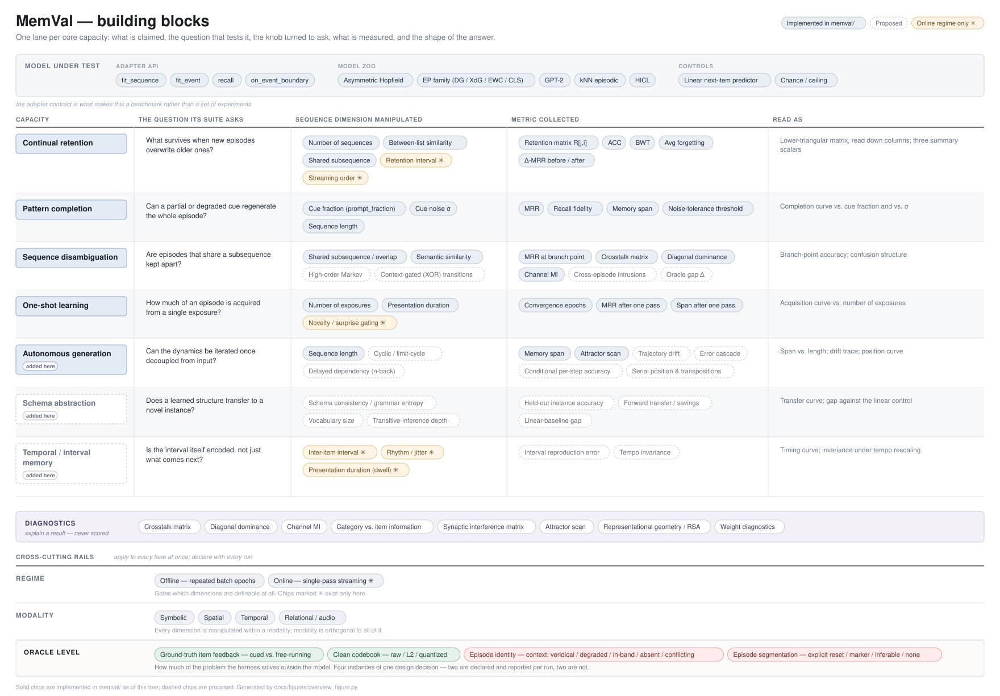

# MemVal

A benchmark for sequence memory in hippocampus-inspired models. MemVal puts
every model ("arm") through the same two suites, **spatial** (place-cell routes
through a T-maze) and **symbolic** (word lists). It scores each arm on five
capacities:

- **Continual retention**: holding old sequences while new ones are learned.
- **One-shot learning**: acquiring a sequence from few presentations.
- **Pattern completion**: recall from a corrupted, partial or displaced cue.
- **Sequence disambiguation**: telling apart sequences that share a stretch.
- **Serial order**: unrolling a learned sequence, including interval timing.

MemVal is a benchmark, not a model. An arm that floors a section is a finding,
not a bug to patch. `docs/capacities/capacities.md` defines the capacities, and
`docs/capacities/capacity_questions.md` turns each one into measurable
dimensions.



## The model zoo

| arm | `--model` | source |
|---|---|---|
| Asymmetric Hopfield (reference) | `ahn` | delta-rule linear associator |
| Theta-phase | `theta` | Hasselmo, Bodelon & Wyble 2002 |
| Equilibrium Propagation | `original_eqprop` | Scellier & Bengio 2017 |
| Temporal predictive coding | `temporal_pc` | Tang, Barron & Bogacz 2023 |
| Predictive recirculation | `predictive_recirculation` | Chen, Zhang, Cameron & Sejnowski 2024 |
| DTS echo-state network | `dts_esn` | Tanaka et al. 2022 |

Settings, budgets and provenance: `docs/models/model_table.md`. Retired arms
(spiking EP, Bush/Vieth STDP, BCPNN, DG/EWC EqProp variants, GPT-2, KNN, HiCL)
are kept at git tag `archive/pre-cleanup`.

## Quick start

```bash
python -m venv .venv && source .venv/bin/activate
pip install -e ".[dev]"

python bin/run_benchmark.py --list-benchmarks
python bin/run_benchmark.py --model ahn --suite spatial --n-trials 5
pytest tests/
```

The full CLI guide, including the per-arm capacity run and the cross-arm
comparison, is `docs/running.md`.

## Layout

```
memval/
  models/        HippocampalModel base, capability declarations, baselines/ (the zoo)
  benchmarks/    suite pipelines (spatial, symbolic, online_symbolic) and their sections
  generators/    T-maze variants, bifurcating routes, overlapping symbolic sequences
  encoders/      place-cell, symbolic, sparse, hierarchical, audio encoders
  metrics/       capacity, retention, plasticity metrics
  diagnostics/   weight-space and behavioural forgetting diagnostics
bin/             CLI entry points: run_benchmark.py (+ MODEL_REGISTRY), scoring, plots, probes
tests/           pytest suite
examples/        small runnable demos; some are cited as protocol references
data/            vocab.json for the symbolic suite
results/         committed runs; zoo_capacity_run/ is the main comparison
docs/            see docs/index.md
```

## Results

The current comparison is `results/zoo_capacity_run/`. It holds one scorecard
per arm and the cross-arm figures in `_compare/`. `index.html` browses all of
it; serve the repo with `python -m http.server 8010` and open
`/results/zoo_capacity_run/index.html`. The write-up is
`docs/reports/capacity_report_zoo.md`.
