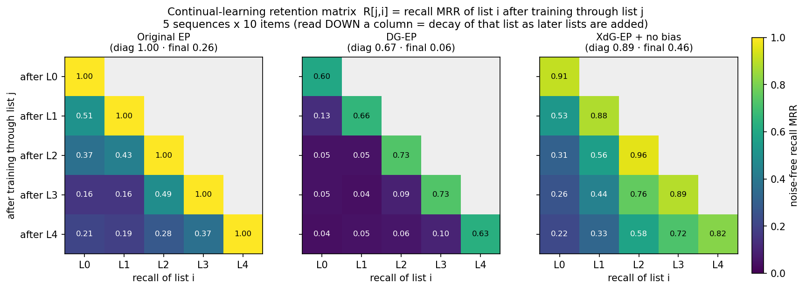

# Debugging Continual Learning in Equilibrium Propagation: A Diagnostic-Framework Case Study

**What this documents.** How a small set of *complementary* diagnostics — behavioural
recall, representational **Jaccard**, weight-update **cosine**, and per-parameter
**Fisher** attribution — guided us from a plainly-forgetting Equilibrium-Propagation
(EP) sequence model to a working continual learner. Each limitation we hit was invisible
to the behavioural curve alone and was surfaced by a *different* lens. This is both a
record of the reasoning and a template for instrument-guided model refinement.

Task throughout: the **symbolic multiple-sequences** benchmark — train list A (fruits),
then list B (animals) on the same weights, measure how much list A's recall degrades.
Encoder: 100-dim zero-centred `SymbolicEncoder`. Later stages scale to 5 sequences × 10
items.

> Numbers below are labelled **[bench]** (recorded pipeline `delta_mrr`), **[real]**
> (real `SymbolicEncoder`, moderate config), or **[toy]** (a non-negative-code sandbox
> used to prototype the metrics). Where toy and real disagreed, the real encoder is
> authoritative — and once corrected a wrong call (see Stage 4).

---

## The framework (three lenses, one interface)

`memval/diagnostics/` — model-agnostic, capability-gated tiers:

- **Behavioural** — `one_step_accuracy`, and the noise-free **`retrieval_margin`**
  (cosine margin) / `retrieval_mrr`. *What does it recall?*
- **Geometry** — `representation_overlap`: per-layer **Jaccard** of active units, A vs B,
  against a random-chance floor. *Where in the network is separation achieved or lost?*
- **Weights** — `update_interference` (**cosine** of EP update directions),
  `fisher_diagonal`, `fisher_attribution` (per-parameter **Fisher** × displacement²).
  *Which parameters collide, and which actually cause the forgetting?*

A model exposes three optional hooks (`named_representations`, `transition_grads`,
`named_parameters`); each tier runs on whatever the model supports.

---

## The debugging trajectory

### Stage 1 — Original EP forgets, and the cause is shared synapses

- **Symptom.** Training B overwrites A. **[bench]** `delta_mrr` ≈ **−0.561**
  (A: 0.922 → 0.361). **[toy]** list-A recall 1.00 → 0.00.
- **Lens.** Cosine interference matrix on the EP two-phase update directions — the
  weight-space overlap between A-transitions and B-transitions.
- **Guiding output.** a↔b block mean |cos| ≈ **0.54** [toy] / **0.50** [real], comparable
  to the *within-list* overlap (~0.67), versus a random-direction baseline of ≈ **0.012**
  → the two lists' updates are **~40–80× more aligned than chance**. They steer the *same*
  synapses, so B's learning cannot help but rotate A's.
- **Decision.** Orthogonalise the input so A and B recruit disjoint populations →
  prepend a **Dentate-Gyrus (DG)** pattern separator (frozen random expansion + feedback
  inhibition).

### Stage 2 — DG makes it *worse*; separation stops at the input

- **Symptom.** No gain — a regression. **[bench]** `delta_mrr` ≈ **−0.806** (worse than
  the plain net).
- **Lens.** Layered **Jaccard** (input-layer *and* hidden-layer active units) + the cosine
  interference **split by weight matrix** (`W_ih` vs `W_ho`).
- **Guiding output** [real]:
  - INPUT Jaccard(A,B): **1.000 → 0.022** (floor 0.023) — DG separates the input *to the
    floor*.
  - HIDDEN Jaccard(A,B): **0.58 → 0.66** (floor ~0.35) — *unchanged*; separation did **not**
    propagate.
  - `W_ih` a↔b cos 0.40 → 0.30 (input side eased) but `W_ho` a↔b cos stays **~0.6–0.78**.
  - Diagnosis: the dense `W_ih` re-mixes the disjoint DG codes back into a shared hidden
    representation, so the **hidden→output readout still collides** — and DG sharpens A's
    code, giving B a *cleaner* readout to capture.
- **Decision.** Gate the hidden layer too → **XdG**: a DG-derived **k-WTA** mask that
  confines each item to a sparse, near-disjoint hidden subnetwork (protecting both `W_ih`
  rows and `W_ho` columns).

### Interlude — a metrology correction: the benchmark metric was measuring the wrong thing

- **Symptom.** On the real encoder, DG's *recall* looked broken (MRR **0.68** vs Original
  **0.96**) — yet a frozen, information-preserving separator "should have no effect in
  theory."
- **What led us to check it.** Two triggers converged: (1) the switch from the sandbox to
  the benchmark changed **not just the encoder but the evaluation metric** — the toy scored
  a *noiseless* one-step decode, whereas the benchmark's `measure_recall_associative`
  **injects Gaussian cue noise (σ=0.05)** (it needs that noise for its multi-trial
  Monte-Carlo MRR); and (2) the mechanistic realisation that a pattern separator's *whole
  job* is to make similar inputs dissimilar, so it must **amplify** cue noise — its hard
  top-k threshold is non-Lipschitz.
- **Lens.** A recall cue-noise sweep (train A only), measuring recall *and* the DG code's
  Jaccard-distance between clean and noisy cues.
- **Guiding output** [real]:
  - At σ=0: DG **0.89** ≈ Original **1.00** (DG is nearly benign for exact cues).
  - DG's noise-degradation slope is **~4× steeper** than Original's.
  - DG code-shift (clean vs noisy) = 0 / 0.17 / 0.29 / **0.55** / 0.76 / 0.89 at
    σ = 0 / .01 / .02 / **.05** / .1 / .2 → at the benchmark's σ=0.05, **55% of the active DG
    units flip**. The separator maps the noisy cue *away* from its own clean code.
  - Interpretation: the benchmark metric conflated **noise-robustness** with **forgetting**
    (biologically, a DG separator needs a downstream CA3-style completion stage for noise
    tolerance — which this model lacks).
- **Decision.** Measure forgetting **noise-free**: score a single deterministic pass by a
  graded rule — the **cosine margin** `cos(pred, true) − max_distractor cos` (primary) and
  reciprocal-rank MRR — and get variability from **seeds**, not injected noise.

### Stage 3 — XdG still forgets: the leak is a *bias vector*

- **Symptom.** With the clean metric, XdG's list-A retention still fails — and it *inverts*.
  **[real, noise-free margin]** list-A margin **+0.318 → −0.174** after B (90% negative,
  MRR 0.34). (For contrast: Original erodes to the boundary **+0.025** / MRR 0.78; DG
  deep-inverts **−0.318** / MRR 0.16.)
- **Lens.** Per-parameter-group **Fisher attribution**: estimate list-A's realised
  forgetting as `Σ F_A[i]·(θ_B − θ_A)²`, split across `W_ih / W_ho / b_h / b_o` — the
  biases that cosine/Jaccard *structurally cannot see*.
- **Guiding output** [real, forgetting attribution %]:
  - `b_o` share: Original **93%**, DG **74%**, **XdG 97%** — as gating removes the weight
    collisions, the leak concentrates in the **shared, ungated output bias `b_o`**.
  - Decomposed: XdG `b_o` importance-mass **64%** but displacement only **7%** →
    *importance-driven* (A leans on `b_o`; B's small nudge to it does the damage). `W_ho`
    has 90% of the displacement but only 23% of the contribution — gating puts B's big
    changes off A's important axes.
  - Mechanism: `b_o` captures the targets' shared category-mean; training B drags it from
    the fruit-baseline to the animal-baseline, biasing *every* output toward B.
- **Decision.** `b_o` is expressively redundant (full `W_ho` maps each distinct cue→target)
  **and** the dominant leak → **drop it** (`use_output_bias=False`).

### Stage 4 — Verify the fix; discover it only works *with* the gate

- **Lens.** `use_output_bias` ablation across all three models (noise-free margin), via the
  new model flag.
- **Guiding output** [real, list-A MRR after B, bias on → off]:
  - Original **0.78 → 0.90** ✅
  - XdG **0.34 → 0.90** ✅ (inversion gone; base learning *improved*, +0.318 → +0.372)
  - DG **0.16 → 0.16** ❌ — **no change**
- **Correction (a self-correcting moment).** Dropping `b_o` is **not** a standalone fix: it
  *relocates* the shared-mean into `W_ho`, which only helps if `W_ho` is gated. XdG gates
  it (recovers); DG's `W_ho` is dense/shared and its sharp codes let B capture it cleanly
  (no help). This also corrected an earlier *toy* conclusion that `b_o` was "mostly an
  artifact" — on the real encoder it is genuinely dominant.
- **Recipe.** **XdG (gate hidden→output) + `use_output_bias=False`, together.** Neither half
  suffices alone.

### Stage 5 — Scale it: XdG's advantage becomes decisive

- **Lens.** The **retention matrix** `R[j,i]` (noise-free MRR of list i after training
  through list j), 5 sequences × 10 items — reading *down a column* shows each list's decay
  as later lists are added.
- **Guiding output** [just-learned diagonal / final retention of L0–L3]:
  - Original **1.00 / 0.26**, DG **0.67 / 0.06**, **XdG 0.89 / 0.46**.
  - XdG wins on **both** axes; its bottom row is a clean **recency gradient**
    (0.22 / 0.33 / 0.58 / 0.72) — the cumulative-coverage law `(1−p)^n` made visible.
  - Scale **exposes DG's double failure**: at 10 items/list it can't even *learn*
    (diagonal 0.67) because similar items interfere in its *ungated shared hidden layer*,
    *before* any cross-list forgetting; XdG's gating fixes exactly this.
  - Caveat surfaced by the matrix: raw "forgetting" is deceptive — DG's below-diagonal loss
    looks smallest only because it never learned. Read **diagonal (learnability) + final
    retention together**, which the matrix shows at a glance.

---

## The meta-lesson

Every limitation was surfaced by a **different** lens, and the behavioural number was blind
to all of them:

- **Cosine** found the weight collision (Stage 1).
- **Layered Jaccard** found *where* separation was lost (Stage 2).
- A **noise sweep + code-shift** found a *measurement* artifact — a separator's noise
  amplification masquerading as forgetting (Interlude).
- **Fisher attribution** localised the residual leak to a **bias vector** no representational
  metric could see (Stage 3).
- The **retention matrix** separated *learnability* from *retention* at scale, where a
  scalar would have misled (Stage 5).

Same forgetting curve; five distinct causes; five distinct tools. Instrument-guided
debugging turned "EP forgets" into a specific, mechanistic sequence of fixes.

**Final model:** DG separation + XdG hidden gating + no output bias — a working
continual learner that, at scale, both learns and retains better than the plain net.

---

## Reproducibility

- Framework: `memval/diagnostics/` (+ tests `tests/test_diagnostics.py`,
  `tests/test_output_bias_flag.py`).
- Model flag: `OriginalEqPropSequenceNetwork(..., use_output_bias=False)` (inherited by
  DG/XdG).
- Scripts (retired 2026-09-27; `git show archive/pre-cleanup:<script>`): `standalone_ab_cosine_interference.py` (Stage 1, cosine interference
  matrix A vs B), `standalone_cf_interference.py` (Stage 2, layered Jaccard + split-matrix
  cosine, Original/DG/XdG), `standalone_dg_noise_sensitivity.py` (Interlude),
  `standalone_fisher_attribution.py` (Stage 3), `standalone_bo_ablation.py` (Stage 4),
  `standalone_scale_matrix.py` (Stage 5).
- Figure regenerated by `docs/figures/plot_retention_matrices.py`.

---

## Retention matrices (5 sequences × 10 items)

*Each cell is the seed-averaged noise-free recall MRR of list `i` after training through
list `j`; the upper triangle is undefined (not yet trained). Read **down a column** for a
list's decay as later lists are added. **Original** learns every list (diagonal 1.00) but
decays to ~0.26. **DG** fails on both axes — weak learning (0.67) and near-total loss
(0.06). **XdG + no bias** learns well (0.89) and retains best (0.46), with a graceful
recency gradient that traces the cumulative-coverage law.*
