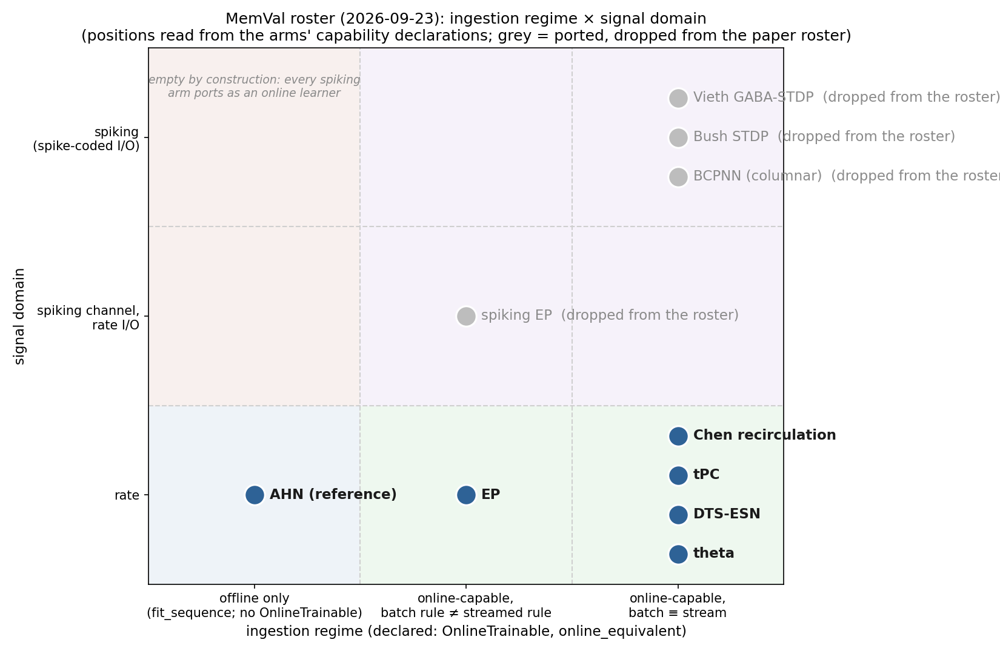

# Model roster — settings as run (revised 2026-09-23, budgets re-sized same day)

Six **rate** arms are active in `MODEL_REGISTRY` (`bin/run_benchmark.py`). The spiking
arms (spiking EP, BCPNN, Bush STDP, Vieth GABA-STDP) are ported but **dropped from the
paper roster** on 2026-09-23; their registry entries are commented out verbatim. Parameter
counts are read from the instantiated classes; settings from the registry and class defaults.

## Core table

| model (registry key) | architecture (100-d symbolic) | learnable params 100-d / 420-d | fixed budget (epochs) | sizing basis: epochs to criterion (material) | learning rule | plasticity locus | credit assignment | inference / settling | LR | seed |
|---|---|---|---|---|---|---|---|---|---|---|
| AHN (reference) (`hopfield`) | 100→100 (single asymmetric matrix) | 10,000 / 176,400 | 2 / 4 spatial | 1.0 sym (1/1 seeds), 2.0 spa (1/1) | delta rule (LMS), one transition per step | one weight matrix | local (post-synaptic error) | feed-forward, 1 step | 0.1 | 42 |
| Theta-phase (Hasselmo 2002) (`theta`) | 100→100 (single matrix; 256-step theta cycle) | 10,000 / 176,400 | 2 / 4 spatial | 1.0 sym (1/1 seeds), 2.0 spa (1/1) | Hebbian under EC/CA3 phase gating; = delta rule at optimal phases | one weight matrix | local (oscillatory phase separation) | 1 theta cycle, 256 phase steps | 0.1 | 42 |
| DTS-ESN (Tanaka 2022) (`dts_esn`) | 100→[400 reservoir, τ∈{0.1..20}]→100 (+1 timing unit) | 40,100 (+55,879 frozen) / 168,420 | 2 | 1.0 sym (5/5 seeds), spatial unreached | RLS on the readout; reservoir fixed | readout only (W_out, W_time) | local to readout (no credit into reservoir) | leaky integration, dt=0.05, ρ=0.9 | — | 42 |
| Temporal PC, 2-layer (Tang 2023) (`temporal_pc`) | 100→60 latent→100 (recurrent latent) | 9,600 / 28,800 | 83 / 95 spatial | 41.2 sym (5/5 seeds), 47.2 spa (5/5) | local prediction-error Hebbian (tPC); latent by energy relaxation | W_r (latent→latent), W_out | local (per-layer prediction error; error to hidden via W_outᵀ) | 100 relaxation steps, inf_lr=0.01 | 0.05 | 42 |
| Predictive recirculation (Chen 2024) (`predictive_recirculation`) | 100→60 latent→100 (U in, W recurrent, V out) | 15,600 / 54,000 | 43 / 38 spatial | 21.5 sym (4/5 seeds), 18.67 spa (3/5) | three local outer-product updates; latent by ONE forward pass | U, W, V | local; error reaches the hidden layer through the forward weights U (recirculation), not Vᵀ | feed-forward, 1 pass | 0.05 | 42 |
| Equilibrium Propagation (S&B 2017) (`original_eqprop`) | 100→500→100 | 100,600 / 420,920 | 43 / 39 spatial | 21.4 sym (5/5 seeds), 19.4 spa (5/5) | EP contrastive two-phase (free vs nudged, β=1.0) | W_ih, W_ho, biases | local in the limit β→0 (equals BP gradient) | 20 settling steps, dt=0.5 | 0.1 | 42 |

## Additional hyper-parameters and protocol declarations

| model | other hyper-parameters (registry + class defaults) | provenance | online-capable / batch≡stream | rollout mode | uses prompt history / primeable |
|---|---|---|---|---|---|
| `hopfield` | activation=relu | reference implementation (no mother paper) | no / no | observation | no / no |
| `theta` | rectify_output=True, modulation_depth=1.0 | from equations (paper eqs 2.4–2.14) | yes / yes | observation | no / no |
| `dts_esn` | n_units=400, tau_min=0.1, tau_max=20.0, spectral_radius=0.9, dt=0.05, predict_timing=True | port; RLS readout is ours (paper: batch ridge) | yes / yes | hybrid | yes / yes |
| `temporal_pc` | inf_iters=100 | against reference; latent = paper's ≈0.6× input ratio | yes / yes | latent | yes / yes |
| `predictive_recirculation` | — | from equations (Results Eq. 2, STAR Eqs. 5–11 only; not the BPTT headline model) | yes / yes | hybrid | yes / yes |
| `original_eqprop` | n_settle_steps=20, beta=1.0 | from equations; width/β/steps = paper Table 2 | yes / no | observation | no / no |

## Column notes

- **architecture** — layer sizes at the symbolic suite's 100-d embedding. The spatial
  suite's place-cell grid is **fixed per suite at 20×20 = 400 cells** (2026-09-23):
  `tmaze_completion` 400 features, `tmaze_disambiguation` 400 + 20 odour = 420,
  `tmaze_reversal` 400 + 20 reward = 420. The grid is uniform; the total width differs
  only because two sections add a 20-dim cue channel their task requires. Hidden sizes
  are unchanged, so only the input/output layers scale.

  **The two suites' dimensions are not commensurable and must not be described as
  aligned.** `embedding_dim` buys *item separability* (mean \|cos\| between items 0.585 →
  0.181 → 0.115 at dim 25 → 100 → 200), the axis the symbolic suite manipulates.
  `n_cells` buys *grid resolution*, and the field width is `sigma_scale × route step`,
  not tied to the grid — so the right grid depends on the route's step, and the floor is
  minimised at σ/spacing ≈ 0.65 (T-maze step 0.143 → 100 cells; reversal step 0.067 →
  400 cells). A brief experiment reducing the disambiguation route to 100 cells was
  reverted in favour of a suite-uniform width; widening the fields to let the reversal
  route run at 100 cells was rejected outright because it halved that section's reversal
  trials-to-criterion and collapsed EP's goal-identity margin from 1.000 to 0.000.
  Say "the spatial suite uses a 20×20 place-cell grid", never "all suites use 100
  dimensions".
- **learnable params** — arrays the learning rule writes. DTS-ESN additionally carries
  frozen random weights (`W_in` 400×100 dense, `W` 400×400 at 10% connectivity), counted
  separately because they are never trained; `W_time` (1×401) is the timing head.
- **fixed budget** — `n_epochs` in the registry: the exposure every *control* section
  trains for. Rule: **2× the epochs the arm needs to reach criterion**, sized on the
  canonical material of each suite (the 7-item list; the 15-step T-maze), taking the
  larger of the two, and **split per modality** (`modality_kwargs`) when they differ
  materially — EP now (12 vs 58). An unreached criterion contributes no budget: the arm
  runs at its other material's budget with `criterion_reached=False` recorded on that
  suite. One epoch = one full pass over the sequence; for EP that is ONE full-batch
  update (a MemVal sequence fits in one batch), so its count is not comparable to a
  minibatch epoch count. Sections where exposure is the *result* (semantic similarity,
  schema, acquisition-under-load, interval) still run the criterion ladder. Budgets for
  EP, tPC and Chen were re-sized 2026-09-23 at the current settings (criterion = perfect
  list under the clean single probe / one-step within eps=0.15; ladder to 512).
  † DTS-ESN never reaches the T-maze criterion and *degrades* with exposure
  (0.357→0.286 from 1 to 64 epochs; RLS over-fits repeated passes).
  ‡ tPC at the paper-ratio latent (60) plateaus at **13/14** steps within eps from 128
  epochs on (mean xy error 0.067; one position misses); it reached at 47 with latent 128.
  § Chen plateaus at **4/14** (mean xy error 0.17 at 512): a substantive spatial result
  for the arm at these settings, not an exposure effect.
- **credit assignment** — whether the update uses only locally available signals;
  "local in the limit" for EP means the contrastive update equals the backprop gradient
  as β→0 but is computed from two settled states.
- **online-capable** — declares `OnlineTrainable` (`fit_event`); **batch≡stream** —
  `online_equivalent`. EP averages the batch delta by 1/n_transitions, so a
  batch-vs-stream contrast on it confounds ingestion with rule
  (docs/online_continual_benchmark.md §1b).
- **rollout mode** — what the arm's own `recall()` feeds back (docs/rollout_protocol.md).
  Chen is HYBRID and tPC LATENT, so their `recall()` scores are not comparable
  (`rollout_modes_comparable`); the pair compares on `predict_next`-driven metrics.
- **uses prompt history / primeable** — `prompt_conditioned` / `StatePrimeable`
  (`observe`, non-learning state update). False is honest for an arm that carries no
  state between steps.
- **probe protocol** (all arms) — clean single cue, one probe; noise and masking swept
  only where they are the manipulation (docs/probe_protocol.md). All six arms are
  deterministic at forward.
- **standard but unlisted**: encoder = `SymbolicEncoder(embedding_dim=100,
  category_variance=0.2, seed=42)`; lists are 7 items; every arm seeds at 42.

## Paper-defined or ours? — provenance audit (2026-09-06)

Every architecture and hyper-parameter above, checked against the mother paper.
**P** = the paper's value; **P\*** = the paper's value adapted by a stated rule;
**ours** = chosen here, with the reason. Sources: Scellier & Bengio 2017 Table 2
(arXiv 1602.05179); Tanaka et al. 2022 PRR 4 L032014 (arXiv 2108.09446); Tang et
al. NeurIPS 2023 Table 1 (arXiv 2305.11982); O'Connor, Gavves & Welling AISTATS
2019 §4 (PMLR v89); Tully et al. 2016 PLoS CB 12(5) e1004954; Hasselmo, Bodelón &
Wyble 2002 Neural Comput 14(4) (author HTML; MIT Press paywalled).

| arm | setting | paper | ours | verdict |
|---|---|---|---|---|
| **EP** | hidden width | 500 (784-500-10); 500-500(-500) deeper | **1024** | **ours** — was injected by the spatial pipeline only; now explicit. No paper basis; sized so a 420-d spatial input had a wider hidden layer. |
| | nudge β | 1.0 (all MNIST nets) | 0.5 | **ours** |
| | free / clamped iterations | 20 / 4 (1 hidden); 100 / 6; 500 / 8 | 50 settling steps (both phases) | **ours** — between the paper's 1- and 2-hidden settings |
| | step ε (dt) | 0.5 | 0.5 | **P** |
| | learning rate | α₁=0.1, α₂=0.05 (per layer) | 0.1 (single) | **P** for the first layer; the per-layer split is dropped |
| | activation | hard sigmoid ρ(s)=0∨s∧1 | tanh | **ours** |
| **spiking EP** | hidden width | 500 (784-500-10) | 100 | **ours** — documented: MemVal sequences are far smaller |
| | settling ticks (neg / pos) | **(100, 50)** for the binary net — the paper's own extension of (20, 4) | 100 / 50 | **P** |
| | predictive-coding λ, ε schedules | OSA / GP-searched schedules (Appendix C; λ=0.275 constant in the OSA runs) | `0.354/t**0.0`, `0.503/t**0.292` | **P\*** — the wrapper cites the paper's parameter-search values; the appendix with the table is in the supplement, not re-verified here |
| | β | not stated in main text | 0.5 | **ours** |
| | `random_flip_beta` | on (upstream default) | off | **ours, deliberate** — upstream's ~3000 minibatch updates/epoch average the sign noise out; MemVal's one full-batch update/epoch does not (0.24 vs 0.88 accuracy over 5 seeds) |
| | learning rate | not stated in main text | 0.05 | **ours** |
| | input mapping | [0,1] inputs (MNIST) | offset 0.5 / gain √n symbolic; 0 / 1 spatial | **P\*** — the paper needs no mapping; ours maps unit-norm embeddings onto the paper's input range, per modality |
| **DTS-ESN** | reservoir size N | 200 (Rulkov, HR, tc-VdP); **400** (tc-Lorenz) | 400 | **P** (the paper's Lorenz setting) |
| | leak-rate distribution | log-uniform in [α_min, α_max], α_max = 1, α_min down to 10⁻³ | τ log-uniform in [0.1, 20] with dt 0.05 → α ∈ [0.0025, 0.5] | **P\*** — same law, range shifted to the interval scale the suite uses |
| | spectral radius ρ / input scale γ | γ = ρ = 1 (three systems); 0.1 (tc-Lorenz) | 0.9 / 1.0 | **ours** for ρ (chosen < 1 so the rest state is stable and gaps decay — docstring); γ = **P** |
| | connectivity d | 0.1 | 0.1 | **P** |
| | readout | ridge regression, β = 10⁻³ | RLS (λ = 0.999, δ = 1) | **ours** — RLS makes the readout genuinely online; the paper's is batch |
| **tPC (2-layer)** | latent width | 480 for 784-d input; 630 for 1024-d (≈0.6× input) | 128 for 100-d (1.28× input) | **ours** — wider relative to input than the paper's ratio |
| | inference iterations / step | 100 / 1e-2 ("no significant impact") | 50 / 1e-2 | **P** for the step; iterations halved (**ours**) |
| | learning rate | 1e-4 (MNIST), 5e-1 (binary), 2e-4 (MovingMNIST) | 0.05 | **ours** — the paper's range spans 4 orders; nothing to inherit |
| | epochs | 800–1000 | budget 86 (criterion 43) | **ours** by construction — exposure is set by the benchmark's criterion, not the paper's schedule |
| | non-linearity | not specified in Table 1 | tanh | **ours** |
| **BCPNN** | network | 9 HC × 10 MC × 30 pyr = 2700 pyr; 30 baskets/HC (270) | 100 HC × 10 MC × 3 pyr = 3000 pyr; 3 baskets/HC (300) | **P\*** — HC count set by the feature dimension (codec), cells/MC and baskets/HC scaled ×1/10, with all gains renormalised so a full pattern delivers the paper's drive (docs/bcpnn_spiking_port.md) |
| | trace τ (z AMPA / z NMDA / p) | 5 ms / 150 ms / 5000 ms | paper's | **P** |
| | f_max, f_min, ε | 20 Hz, 0.2 Hz, 0.01 | paper's | **P** |
| | pattern duration / epochs | 100 ms; 10 patterns; 50 epochs (10 in S7) | 100 ms codec window; budget not set (arm inactive; criterion 5 on L=7) | **P** for the window; exposure by criterion |
| | AdEx, Δt | AdEx; 1 ms trace grid | AdEx; 1 ms traces, 0.2 ms membranes, 2 substeps | **P\*** |
| **theta** | network | unit counts not stated; a_CA3, a_EC are binary vectors | n×n single matrix (100×100) | **P\*** — the only structure the equations define; size follows the input |
| | phases φ_EC / φ_CA3 / φ_LTP; X | 0° / 180° / reference; X = 1 (Fig 4) | 0 / π / 0; 1.0 | **P** |
| | steps per theta cycle | continuous integral; discretisation not specified | 256 | **ours** (a discretisation of the paper's cycle integral) |
| | learning rate | no explicit coefficient (Eq. 6) | 0.1 | **ours** |
| **AHN** | — | no mother paper: the harness's reference linear associator (delta rule) | n×n, LR 0.1, ReLU readout | **ours** — the controlled pair for theta (identical weight step at the paper's optimal phases) |

**Reading the audit.** The two "quite high" settings you flagged split cleanly:
DTS-ESN's 400 units **is** the paper's own (tc-Lorenz) setting, and its time-constant
law is the paper's; what is ours there is ρ = 0.9 and the RLS readout. EP's 1024
hidden units are **not** paper-defined (the paper uses 500) and neither are β = 0.5 or
the 50-step settle — those three are the settings most worth either restoring to the
paper's values (500 / 1.0 / 20+4) or defending explicitly in the methods. Everything
in the spiking arms that touches the *learning rule* is the paper's; what we changed
is width (spiking EP), cell counts under a stated normalisation (BCPNN), and the
input mapping.
| **Chen (predictive recirculation)** | latent width, LR | paper validates the local rule on one 6-step sequence; demo sizes not extracted | 60 / 0.05 | **ours** — pair-matched to tPC so the pair varies only (i) latent by forward pass vs relaxation and (ii) error via U vs W_outᵀ |
| | rule | Results Eq. 2, STAR Eqs. 5–11 (local rule); headline model is BPTT | local rule only; plain SGD; first event primes | **P** for the rule; dU/dW truncate the temporal term and substitute U for Vᵀ, as the paper's local rule does |
| | rollout | completion protocol | HYBRID | **P** — hence not comparable with tPC's LATENT `recall()`; compare on `predict_next`-driven metrics |

## Exposure sizing protocol (settled 2026-09-23)

`bin/size_budgets.py` derives every fixed budget; the record it writes is
`results/budget_sizing.json`.

- **Material, load-matched across suites.** Symbolic: one **10-item** list
  (9 scored transitions). Spatial: one **10-transition**
  route (11 points). Equal transition counts, so a per-suite
  difference is about the modality and not about sequence length.
- **Criterion 0.95.** Symbolic: cued one-step MRR under the clean single
  probe — quantised to k/9, so in practice 9/9.
  Spatial: one-step predictions landing within `eps` of the next position, i.e.
  10/10.
- **`eps` is RELATIVE to the route's step** (`relative_eps`, k = 1.05), not absolute.
  The T-maze keeps a fixed physical extent, so its step scales as 1/L: 0.143 at 15
  points but 0.2 at 11. The old fixed 0.15 therefore
  demanded sub-step precision on a shorter route, and any change of route length read as
  a change in capability. k = 1.05 reproduces 0.150 exactly on the historical 15-point
  route; here it gives **0.21**. Every run records `tmaze_pc_eps_mode`,
  `_eps_k`, `_route_step`, `_decode_floor_max` and `_decode_floor_frac_of_eps`.
PLACEHOLDER (≈0 along the stem, which lies on the
  cell grid's own axis; ~0.05 on the arm). Read any spatial score against that floor.
- **Seeds.** 5 model seeds; budget = ⌈2 × **mean epochs over the seeds that REACHED**⌉.
  Seeds that never reach are excluded from the mean and **counted** — read `n_reached`
  before quoting a budget.
- **Per suite.** Symbolic and spatial are sized separately (`n_epochs` and
  `modality_kwargs["spatial"]["n_epochs"]`); **online inherits symbolic**, being the same
  material through a different ingestion path. A suite whose criterion is unreached on
  every seed gets **no** budget: it runs at the other suite's and records
  `criterion_reached=False`.

### Sized budgets

| arm | symbolic / online | spatial | symbolic: reached · per-seed epochs | spatial: reached · per-seed epochs | seed-invariant |
|---|---|---|---|---|---|
| `hopfield` | 2 | 4 | 1/1 · [1] | 1/1 · [2] | **yes** |
| `theta` | 2 | 4 | 1/1 · [1] | 1/1 · [2] | **yes** |
| `dts_esn` | 2 | — | 5/5 · [1, 1, 1, 1, 1] | 0/5 · [512, 512, 512, 512, 512] | no |
| `temporal_pc` | 83 | 54 | 5/5 · [39, 34, 48, 41, 44] | 5/5 · [32, 42, 12, 35, 14] | no |
| `predictive_recirculation` | 43 | 8 | 4/5 · [10, 512, 18, 40, 18] | 1/5 · [512, 4, 512, 512, 512] | no |
| `original_eqprop` | 43 | 85 | 5/5 · [19, 30, 17, 22, 19] | 5/5 · [40, 47, 43, 42, 40] | no |

**Seeds do nothing for AHN and theta.** Both initialise `W` to zero, so their
trajectory is a deterministic function of the data: all five seeds return identical
numbers at five times the cost. `size_budgets.py` detects this by comparing *all* float
state across seeds and runs one seed for them; the JSON carries `seed_invariant: true`.
Their sd = 0 is a property of the arm and must never be read as a stability finding.
The check deliberately inspects all state rather than trainable arrays only — an earlier
version compared `named_parameters()` and wrongly called **DTS-ESN** seed-invariant,
because its learnable readout also starts at zero while its *frozen* reservoir
(`W_in`, `W`) is drawn from the seed and fully sets its dynamics.

### Three results from the sizing run itself

1. **Relative eps unblocked tPC on spatial.** It was "unreached at 512" under the
   absolute eps on the 14-transition route; it now reaches on **5/5** seeds (mean 47.2).
   The earlier failure was the metric, not the arm — consistent with its cos(pred,target)
   of 0.987 there.
2. **Chen is bimodal across seeds, not merely variable.** Symbolic epochs
   `[10, 512, 18, 40, 18]` and spatial `[512, 512, 8, 26, 22]`: one seed in five, and two
   in five, never reach at all. Mean-over-reached (21.5, 18.7) looks tame and **hides
   that**, which is exactly why `n_reached` ships beside the budget. Its budgets are
   conditional on 4/5 and 3/5 seeds.
3. **DTS-ESN has no spatial budget.** 0/5 seeds reach — it degrades with exposure on
   spatial (a recorded finding), so more epochs make it worse. It runs spatial at the
   symbolic budget with `criterion_reached=False`.

## Revisions since 2026-09-06

1. **Paper values applied, then re-run.** EP (500 / β=1.0 / 20 settle), tPC (latent 60 /
   100 iters) and the new Chen arm were run on the **symbolic and online suites on
   2026-09-07..09** at these architectures — but at the *previous* budgets (EP 220,
   tPC 86, Chen 128 provisional), which were sized before the paper values landed.
2. **Budgets re-sized 2026-09-23** (this revision), at the current settings:

   | arm | L=7 | T-maze | budget | was |
   |---|---|---|---|---|
   | EP | 12 | 58 | **24** symbolic / **116** spatial | 220 |
   | tPC | 38 | unreached (13/14) | **76** | 86 |
   | Chen | 7 | unreached (4/14) | **14** | 128 |

   The zoo results for these three arms are therefore at the current architectures
   but a stale (larger) budget; a re-run at the new budgets will change their
   control-section numbers. Nothing was re-run in this revision.
3. **Spatial suite is mixed.** `tmaze_disambiguation` was re-run 2026-09-08 for every arm
   at the current settings (clip decode, `observe()` on every arm, arm-owned rollout).
   `tmaze_completion` for **EP and theta is still the Sep-4 run** (EP at 1024 / β=0.5 /
   50 settle, criterion exposure; theta at n_epochs=1, criterion) — the 09-09 file
   mtimes come from the disambiguation merge, not a re-run. AHN (09-06, budget 4),
   DTS-ESN (unchanged), tPC and Chen (re-run 09-09) are current.
4. **Spiking arms dropped** from the roster; entries kept verbatim in the registry.
   Spiking EP's budget was never re-sized after its width went 100→500 and it failed
   the stale 22-epoch budget on `noise_invariance`; that is moot now.
5. **Chen added** as tPC's controlled pair (2026-09-08); its exposure is now sized by
   criterion rather than copied.

## Taxonomy

`docs/figures/model_taxonomy.png` places every arm on **ingestion regime** (offline only →
online-capable with a different batch rule → online with batch ≡ stream) × **signal
domain** (rate → spiking channel with rate I/O → spike-coded I/O). Positions are read
from the capability declarations (`OnlineTrainable`, `online_equivalent`, codec
`inner_domain`), not assigned by hand. With the spiking arms dropped (greyed), the run
roster occupies the rate row only: AHN offline; EP online with a divergent batch rule;
theta, DTS-ESN, tPC and Chen online with batch ≡ stream. The offline × spiking cell was
empty by construction even before — every spiking arm ports as an online learner.
