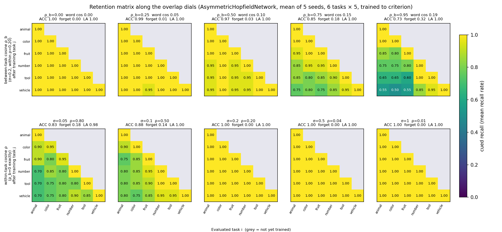
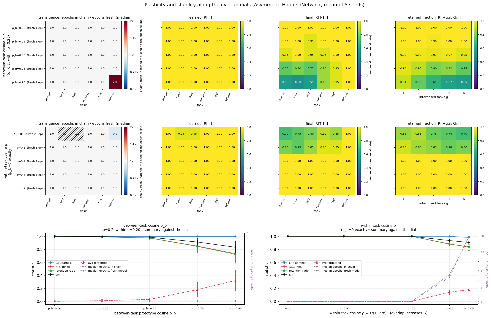
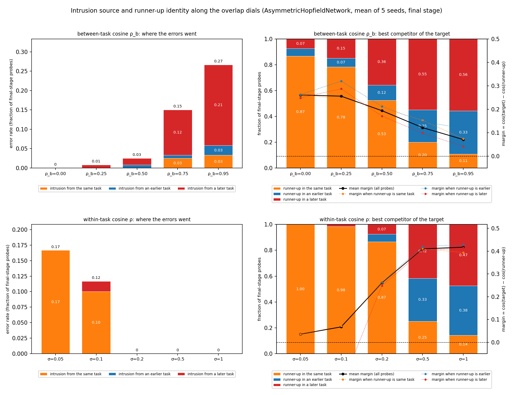
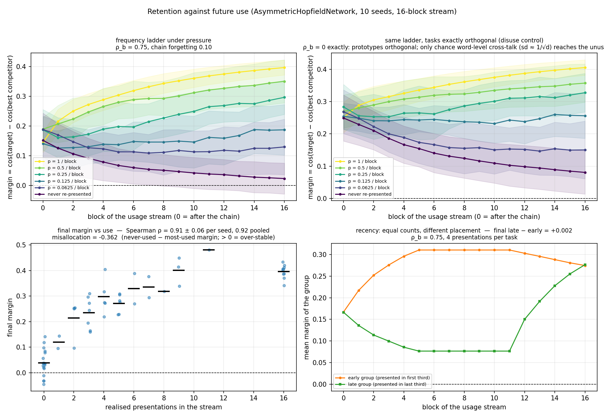
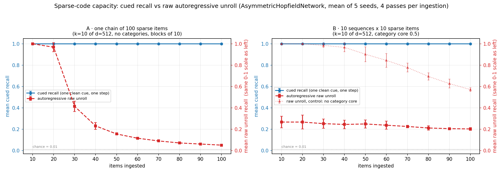

# MemVal capacity report — AHN reference run, and how to reproduce it for every arm

**Purpose.** Handoff for running the full model zoo through the capacity scorecard.
Everything below was established on `AsymmetricHopfieldNetwork` (AHN) between
2026-09-01 and 2026-09-03; the AHN numbers are the reference the other arms are
read against. The interactive version of the AHN report is at
https://claude.ai/code/artifact/8ade319a-c97c-4725-9ef4-cc0d5cd3c88f.

Companion documents, read in this order:
- `docs/capacities/capacity_questions.md` — the five capacities as questions, with the
  dimension each question manipulates and the capability tags.
- `docs/capacities/capacity_coverage_audit.md` — which promises have instruments.
- `memval/benchmarks/exposure.py` — the exposure policy (module docstring).
- `results/ahn_capacity_run/AsymmetricHopfieldNetwork/capacity_scorecard.md` —
  the auto-generated per-metric scorecard for AHN (every key, its dimension,
  role and normalised value).

---

## 1. The runbook

All commands from the project root with `.venv` activated. Replace `<model>`
with a `--model` name from §2 and `<out>` with one results directory shared by
every arm (so the scorecards sit side by side).

```bash
# 1. the two suites, plus the streamed regime (skipped cleanly for arms that
#    do not declare OnlineTrainable -- it writes status: not_applicable)
python bin/run_benchmark.py --model <model> --suite spatial         --output-dir <out> --n-trials 30
python bin/run_benchmark.py --model <model> --suite symbolic        --output-dir <out> --n-trials 30
python bin/run_benchmark.py --model <model> --suite online_symbolic --output-dir <out> --n-trials 30

# 2. schema_consistency under the FOCUSED protocol. The suite default
#    ('extended') is valid for acquisition only; interference and prefix_recall
#    are valid only under 'focused'. Separate output dir, same arm.
python bin/run_benchmark.py --model <model> --suite symbolic \
    --benchmarks schema_consistency \
    --benchmark-args schema_consistency:interference_protocol=focused \
    --output-dir <out>/_schema_focused --n-trials 30

# 3. the serial-order probe (decoded identities; not yet a suite metric -- S-O2)
python bin/probe_serial_order.py \
    --out <out>/<ClassName>/serial_order_probe.json --epochs 1

# 4. the two standalone benchmarks. Neither is scored -- they write
#    suite-shaped directories so bin/build_results_index.py picks the figures
#    up, and both are declared in MAIN_FIGURES under Continual retention.
python bin/sparse_capacity_benchmark.py --model <model> --out <out>
python bin/extinction_timeline.py       --model <model> --out <out> --epochs 3

# 5. score, then render
python bin/score_capacities.py \
    --results-dir <out>/<ClassName> \
    --schema-focused <out>/_schema_focused/<ClassName> \
    --model "<ClassName>"
python bin/build_scorecard_page.py \
    --scorecard <out>/<ClassName>/capacity_scorecard.json \
    --out <out>/<ClassName>/capacity_scorecard.html
```

`<ClassName>` is the model class name (e.g. `AsymmetricHopfieldNetwork`), which
is the directory `run_benchmark.py` writes under `<out>`.

**Two AHN-specific probes are NOT part of the per-arm runbook.**
`bin/probe_oneshot_scale.py` (learning-rate sweep) and
`bin/probe_rollout_cascade.py` (rollout geometry by exposure) hard-code AHN and
need a per-arm hyperparameter not every arm exposes. They are diagnostic panels
in the AHN report, not scored, and should be ported per arm only if that arm's
report needs them.

**Wall-clock on AHN, 30 trials:** spatial ≈ 3 min, symbolic ≈ 6 min, focused
schema ≈ 1 min, probe < 1 min, sparse capacity < 1 min, extinction timeline
< 1 min (12 seeds; ≈ 4 min on `spiking_eqprop`). EP arms train 100–300× longer per epoch and every
section now staircases exposure, so budget accordingly; `--n-trials 10` is a
reasonable smoke run.

---

## 2. The arms, and which questions each can answer

From `MODEL_REGISTRY` in `bin/run_benchmark.py` and the nominal capability
declarations in `memval/models/capabilities.py`:

| `--model` | class | 🕐 online | ⏱ time | ⏱ timing | ⚑ state | modalities |
|---|---|:-:|:-:|:-:|:-:|---|
| `hopfield` | `AsymmetricHopfieldNetwork` | — | — | — | — | spatial, symbolic, online_symbolic |
| `eqprop` | `EqPropSequenceNetwork` | — | — | — | — | spatial, symbolic |
| `original_eqprop` | `OriginalEqPropSequenceNetwork` | ✓ | — | — | — | spatial, symbolic |
| `dg_original_eqprop` | `DGOriginalEqPropSequenceNetwork` | ✓ | — | — | — | spatial, symbolic |
| `dg_xdg_eqprop` | `DGXdGEqPropSequenceNetwork` | ✓ | — | — | — | spatial, symbolic |
| `ewc_dg_xdg_eqprop` | `EWCDGXdGEqPropSequenceNetwork` | ✓ | — | — | — | spatial, symbolic |
| `ewc_original_eqprop` | `EWCOriginalEqPropSequenceNetwork` | ✓ | — | — | — | spatial, symbolic |
| `dg_eqprop` | `DGEqPropSequenceNetwork` | — | — | — | — | spatial, symbolic |
| `ewc_dg_eqprop` | `EWCDGEqPropSequenceNetwork` | — | — | — | — | spatial, symbolic |
| `temporal_pc` | `MultilayerTemporalPCNetwork` | ✓ | — | — | ✓ | spatial, symbolic, online_symbolic |
| `dts_esn` | `DTSESNSequenceNetwork` | ✓ | ✓ | ✓ | ✓ | spatial, symbolic, online_symbolic |

What the tags decide, per `docs/capacities/capacity_questions.md`:
- 🕐 gates question 2.3 (One-shot, `presentations_streamed`, weight 0.25).
- ⏱ gates questions 5.4 and 5.5 (Serial order, `interval_retention` and
  `interval_generation`, weight 0.25 each — **half the capacity**).
- ⚑ (`StatePrimeable`) gates 4.3. `dts_esn` and `temporal_pc` declare it, so for
  those two the withdrawn-discriminator rows are a real ranking axis; for every
  other arm they are protocol-limited and excluded from the score.
  **Contract note (2026-09-03):** the declaration means `observe` moves state
  and a following `predict_next` reads it. That held for `temporal_pc` and was
  broken for `dts_esn` (its `predict_next` rebuilt from rest), so any
  `state_primed=True` DTS-ESN result produced before this date was silently
  cold. Fixed in `dts_esn.py` (`_primed` flag; un-primed probes stay pure).
  Every criterion probe now goes through `probe_next_from_history`, which
  primes declaring arms with the true prefix and hands everyone a 1-D cue.

> `DTSESNSequenceNetwork` is registered as `dts_esn` (2026-09-03) and runs all
> three suites. The `interval_retention` / `interval_generation` sections are
> still not wired — the demos in `examples/` are section-shaped — so 5.4 and
> 5.5 remain *unbuilt* even for the one arm that could answer them.

Untagged arms will show Serial order coverage ≤ 50% by construction.

---

## 3. AHN reference profile

| Capacity | Score | Coverage | Inclusive | Dimensions scored |
|---|---:|---:|---:|---|
| Continual retention | **0.957** | 90% | 0.862 | load, plasticity_under_load, contingency, schema_consistency |
| One-shot learning | **0.868** | 75% | 0.868 | presentations, schema_consistency |
| Pattern completion | **0.622** | 100% | 0.622 | cue_corruption, cue_point, cue_completeness |
| Sequence disambiguation | **0.599** | 100% | 0.263 | contextual_overlap, item_similarity |
| Serial order | **0.673** | 30% | 0.804 | unrolling, establishment |

- **Score** — weighted mean over validated metrics only.
- **Coverage** — share of the capacity's intended dimension weight that produced
  a score. Low coverage means the suite lacks the instrument or the arm lacks the
  capability, not that the model failed.
- **Inclusive** — protocol-limited and guard-failed metrics re-admitted at face
  value; the gap to *Score* is what the exclusions are worth. Where inclusive is
  *lower* (Continual retention, Serial order) a guard-failed dimension was
  scoring 0.

Formula: `n_m = normalise(raw)`; `D_d = Σ v_m n_m / Σ v_m`;
`C = Σ w_d D_d / Σ w_d` over available dimensions;
`coverage = Σ_available w_d / Σ_intended w_d`.

### What AHN showed, capacity by capacity

**Continual retention.** Zero forgetting across a 6-task chain (ACC 1.00) — but
the chain cannot load a 100-dim linear store (30 associations; ACC still 0.999
at the 6×6 vocabulary ceiling), so read the flat matrix as an untested axis.
The real result is the AB/AC section: **AB retention 1.00 with disjoint cues,
0.00 the moment cues collide**, cue-competition cost 1.00, and it is a clean
replacement, not corruption (intrusion rate 0.00). Reversal: 5 trials to
criterion, final perseveration 0.00. Selective retention is guard-failed
(`select_under_pressure` False — the chain never saturated).

*Addendum 2026-09-06 — the flat matrix is a geometry result, not a capacity
one.* The chain builds one task per category, which fixes the between-task
cosine at ~0 (quasi-orthogonal prototypes, ±0.15 on this seed) and so holds the
forgetting lever `x_B · x_A` at zero by construction. With the encoder's new
`between_category_cosine` dial (`docs/sections/encoder_design.md` §6.4) the same chain,
same protocol, same arm, trained to criterion, 5 seeds
(`bin/continual_chain_overlap_sweep.py`; figures
`continual_chain_overlap_matrices.png`, `continual_chain_overlap_axes.png`,
data `continual_chain_overlap_sweep.json` in the symbolic results dir):

| dial (other held) | rung | ACC | avg forgetting | LA | mean epochs to criterion |
|---|---|---|---|---|---|
| between ρ_b (σ = 0.2) | 0.00 → 0.50 | 1.00 → 0.98 | 0.00 → 0.03 | 1.00 | ~1 |
| | 0.75 | 0.85 | 0.18 | 1.00 | 1.1 |
| | 0.95 (word cos 0.19) | 0.73 | 0.32 | 1.00 | 1.4 |
| within σ (ρ_b = 0 exactly) | 1.0 → 0.2 | 1.00 | 0.00 | 1.00 | 1 |
| | 0.1 (ρ = 0.50) | 0.88 | 0.14 | 1.00 | 5.8 |
| | 0.05 (ρ = 0.80) | 0.83 | 0.18 | 0.98 | 66 (censored on some seeds) |

Three readings. (i) **The between dial is the forgetting axis**: acquisition
stays at 1 epoch while the final row darkens and the retained fraction falls
monotonically with interposition gap (0.91 → 0.55 at ρ_b = 0.95). The delta
rule forgets exactly as the overlap product predicts. (ii) **The within dial is
the plasticity axis first**: exposure to criterion rises 1 → 66 epochs before
anything is lost, and the diagonal is pinned by criterion mode, so plasticity
reads off the exposure panel, not the diagonal. (iii) **High within-overlap
also forgets, with categories exactly orthogonal** — because the decodable
margin at ρ = 0.8 is at most 0.2, and the heavy exposure amplifies the
`O(1/√d)` word-level cross-talk that survives exact prototype orthogonality.
Overlap and margin interact; neither dial alone is "the" forgetting knob.
Selective retention now has a regime where `select_under_pressure` can fire
(`--rehearse` on the sweep), which the default chain never gave it.



*Figure A1. The chain's retention matrix at every rung of each overlap dial
(mean of 5 seeds, shared 0–1 scale, grey = not yet trained). Top row:
between-task cosine ρ_b raised at the section's own within-overlap (σ = 0.2).
Bottom row: within-task cosine raised with the categories held exactly
orthogonal. The default chain is the σ = 0.2 panel of the bottom row.*



*Figure A2. Per rung × task: intransigence (epochs task i needed in the chain
divided by the epochs a fresh model needs on task i alone at the same rung,
median over seeds; 1.0 = the stored tasks added nothing to the cost; hatched =
a seed hit the 512-epoch ceiling), learned R[i,i], final R[T−1,i], and retained
fraction by interposition gap; below, LA / ACC / retention ratio / SPI /
forgetting against each dial with the seed spread, and the median epochs in
the chain against the median fresh cost. Under criterion-referenced training
the diagonal is pinned by construction, so plasticity has to be read from the
cost, and the cost has to be read against a fresh baseline: raw epochs conflate
load with material difficulty.*

**Intransigence is 1.00 on every rung of both dials except 1.17 at ρ_b = 0.95.**
At σ = 0.05 the material itself costs a fresh model a median 34.5 passes and
the chain 33.7 — the same number. So AHN never gets harder to write to: the
within dial is an expensive-material regime, not a plasticity-under-load
regime, and on the between dial acquisition stays at one pass while retention
collapses. A linear store loses stability under overlap, never plasticity.

*The attribution is measured, not inferred* (`continual_chain_overlap_intrusions.png`,
`probe_intrusions` in `continual_chain.py`). At the final stage every probe's
decoded word is classed by source, and the target's best competitor is classed
the same way whether or not the probe failed:

| dial | rung | errors: same task / earlier / later | runner-up: same / earlier / later | mean margin |
|---|---|---|---|---|
| between ρ_b | 0.00 | 0.00 / 0.00 / 0.00 | 0.87 / 0.06 / 0.07 | +0.26 |
| | 0.50 | 0.00 / 0.01 / 0.02 | 0.53 / 0.12 / 0.36 | +0.19 |
| | 0.75 | 0.03 / 0.01 / 0.12 | 0.20 / 0.25 / 0.55 | +0.12 |
| | 0.95 | 0.03 / 0.03 / 0.21 | 0.11 / 0.33 / 0.56 | +0.07 |
| within σ | 0.05 (ρ 0.80) | 0.17 / 0.00 / 0.00 | 1.00 / 0.00 / 0.00 | +0.04 |
| | 0.1 (ρ 0.50) | 0.10 / 0.00 / 0.02 | 0.98 / 0.00 / 0.02 | +0.07 |
| | 0.2 (ρ 0.20) | 0 / 0 / 0 | 0.87 / 0.06 / 0.07 | +0.26 |
| | 1.0 (ρ 0.01) | 0 / 0 / 0 | 0.14 / 0.38 / 0.47 | +0.42 |

On the between dial the errors are cross-task and overwhelmingly from *later*
tasks (0.21 vs 0.03 earlier at ρ_b = 0.95): retroactive interference, as the
delta rule predicts. On the within dial every error is a list-mate and the
runner-up is a list-mate on 100 % of probes. The competitor readout also moves
first: at ρ_b = 0.50 accuracy still reads 0.975 but the runner-up has already
switched from a list-mate (0.87 → 0.53) to a later task (0.07 → 0.36), and the
mean margin has fallen 0.26 → 0.19 — the pressure is visible two rungs before
the matrix darkens. The last within row is the control: with no structure
inside or between lists the runner-up is an arbitrary other item and the
margin is at its highest (0.42), which is the encoder's chance geometry, not a
model effect.



*Figure A3. Where the errors go, and who the runner-up is. Left: the error
rate at each rung, split by the source of the intruding word (same task /
earlier task / later task); correct probes are not drawn, they are 1 − the bar.
Right: the target's best competitor
classed the same way for every probe, failed or not, with the mean decision
margin over it. The between dial's errors are cross-task and from later tasks;
the within dial's are list-mates only. The runner-up switches two rungs before
the matrix darkens.*

**Extinction — the trace that stopped paying** (`bin/extinction_timeline.py`,
figures `extinction_route_survival.png` and `extinction_choice_margin.png`,
main-figure set for this capacity). The retention matrix asks whether old
material survives *new* material; this asks what happens to material that is
still presented but no longer pays. Protocol, on a cheese-odour T-maze whose
stem is shared by both arms: train arm A, train arm B, then extinguish one —
the reward block replaced by noise of matched norm and the cheese odour fading
to zero along that arm — five presentations per phase, drawn twice so each arm
is the extinguished one in turn.

Two readouts, and the first is the one that means the same thing for every arm:

- **Is the route still there?** The direction is imposed (the stem is walked in
  and the model is placed on the arm's first step) and it then runs free on its
  own predictions to the cheese. Each decoded position is compared with the
  true one and the mean error divided by the distance between the two arms, so
  1.0 is the exact route and 0.0 is *as wrong as naming the other arm*. **No
  reward channel is involved**, which matters because an arm that represents
  reward-relevance without predicting a reward vector — a value head,
  reward-gated plasticity — cannot be scored on the outcome channel at all.
- **What comes after the choice point?** Cued at the maze entrance, the model
  unrolls the stem on its own predictions; the state it produces after the last
  stem position is scored against the only two possible answers, the first step
  of each arm, as `cos(pred, this arm) − cos(pred, other)`. Signed toward the
  extinguished arm, zero is a real decision boundary, and the ceiling is set by
  the stimulus (`1 − cos` of the two candidates, 0.62 in this maze).

**The AHN result is counter-intuitive twice over.** Extinction does not weaken
the route it acts on: across both mirror conditions the extinguished arm's
trajectory fidelity *rises* (0.79 → 0.89, and 0.31 → 0.71 where interference
had degraded it) and its choice-point margin rises with it, while its outcome
prediction falls (0.54 → 0.25). Every extinction trial is still a presentation
of that route, and nothing in an unconditioned next-step predictor with
temporally local updates lets the missing outcome override that. The animal's
protocol confounds presentation and non-reward in exactly the same way; what
the model lacks is the mechanism that resolves the confound in favour of the
outcome. Two controls pin this down: the same route trained with versus without
cheese gives identical route fidelity, and swapping which arm is rewarded does
not change the choice at all (preference follows the last arm presented). So
reward is causally inert for the choice here, and behavioural reversal learning
is out of scope for this roster rather than out of scope for the protocol.

**One-shot learning.** Cued recall at ceiling after one presentation. Two
caveats that bound what that supports: (i) the score is **direction-only** —
the stored trace varies 7,432× in strength across four orders of learning rate
and MRR does not move, because decoding is cosine-based; (ii) the same weights
need **20 presentations** before autoregressive rollout of an 11-item list
closes (resolved minimum; the log grid first passes at 32). Schema: the ladder is
non-monotone at the *consistent* end (duplicate 9 trials vs within/across 5,
random 10) — the mirror of the EP anomaly at the random end, same confound
(cued recall rewards orthogonality).

**Pattern completion.** σ-tolerance 0.80. Cue masking: tolerance 0.92 for
category features, **0.42 for identity features** — which features are missing
matters more than how many. At 50% identity masking the model-free reference is
0.00 and recall is 0.29: completion in the strict sense. In-bound recall is
saturated at the default `seq_len=8` (guard demotes it; clears at `seq_len=16`).

**Sequence disambiguation.** Above chance to **N = 8** confusable episodes;
the orthogonal control holds near 1.00 at the same N, so the cost is overlap,
not capacity. Discriminator-similarity crossing at 0.567 (the margin puts it
there; accuracy only steps). Delay: at chance from the first withdrawn step —
protocol-limited. The old "similarity cliff" (MRR 1.00 → 0.17 by cosine 0.48)
was a fixed-budget artefact; trained to criterion every rung reaches it and the
cost is **59× exposure** at cosine 0.80.

**Serial order.** `unrolling_gap` 0.31 at cued criterion;
`unrolling_exposure_ratio` 6.6× mean (13× and 17× at L = 9, 11) — unrolling is
expensive, not impossible. `binding_ordinal` is **undefined**, not zero: 0
cued failures in 900 probes, so nothing to classify. Establishment at ceiling
(order established at every grid length; the grid cannot find where it breaks).
Interval questions: not applicable.

*Addendum 2026-09-06 — retention against future use (the environmental-statistics
protocol).* "Forgetting is functional" needs a definition of *useful* that a
next-step predictor can be tested on. This is Anderson & Schooler's: utility is
how often the world re-presents a memory, and an ideal allocator retains in
proportion to expected future use. No reward channel, nothing the model has to
read. `bin/continual_chain_usage_protocol.py`: load the chain at ρ_b = 0.75
(forgetting 0.10 on these seeds), then a 16-block stream in which task *i* is
re-presented per block with probability from the ladder 1, ½, ¼, ⅛, ¹⁄₁₆, 0 —
assignment permuted per seed so chain position is counterbalanced — scored with
the clean single-cue **margin** after every block, because accuracy saturates on
the frequently used tasks. 10 seeds.

| condition | Spearman(final margin, use) | misallocation (never-used − most-used) | late − early |
|---|---|---|---|
| frequency, ρ_b = 0.75 | **+0.91 ± 0.06** (0.92 pooled) | −0.36 ± 0.04 | — |
| same ladder, prototypes orthogonal | +0.88 ± 0.13 | −0.32 ± 0.05 | — |
| recency, equal counts | — | — | +0.002 ± 0.037 |



*Figure A5. (a) Margin trajectory per use-rate level under pressure: the
never-used task falls from 0.15 to 0.02 while the always-used one rises to
0.40. (b) The same ladder with task prototypes exactly orthogonal — the
never-used task still falls, 0.25 → 0.08, through chance word-level cross-talk
(sd ≈ 1/√d), so this is the residual floor, not a zero-interference control.
(c) Final margin against realised presentations, every seed × task. (d)
Recency: equal counts, early versus late placement — the unpresented group
drops while the other is being learned and recovers on its own presentations;
the two end equal.*

Three readings. (i) **AHN is an Anderson–Schooler allocator, and not by
accident.** Retention tracks use at ρ ≈ 0.9 because refresh is total (one pass
restores a task) and interference from the used tasks erodes the rest; an
interference learner in a use-structured environment *is* an allocator, the
environment does the bookkeeping. Misallocation is strongly negative: it never
keeps the unused at the expense of the used. That is the reference behaviour
an over-stable arm (EWC-style anchoring) should fail. (ii) **It tracks
frequency, not recency.** At equal counts, placement makes no difference
(+0.002). The delta rule's interference is error-gated: re-presenting an
already-known task barely disturbs the others, so "fresher" buys nothing once
both groups are at ceiling. Panel (d) shows the mechanism — the unpresented
group loses margin while the other group is still *learning*, then holds. (iii)
**"Exactly orthogonal categories" does not protect a trace under sustained use
of others.** The disuse ladder loses the never-used task almost as fast as the
pressure condition, because the private parts of the codes overlap by chance
and the leak accumulates over ~30 presentations. The suite has no passive
forgetting at all — nothing in the roster carries a decay term — so every
forgetting number here is interference, and the text should say so rather
than let a reader infer a time constant.

*Addendum 2026-09-06 — sparse-code capacity (standalone, not a suite section).*
`bin/sparse_capacity_benchmark.py` with the new k-of-d
`SparseSymbolicEncoder` (k = 10 of d = 512, unit-normalised; overlap law
within = core + (1−core)²k/d, between = k/d, both verified). Two conditions on
one x-axis: **A** one chain of 100 sparse items streamed in blocks of 10 (each
block re-presents the previous block's last item, so exactly the 10 new
transitions are trained and the chain stays one sequence); **B** ten sequences
of ten items with a category core of 0.5, ingested one sequence at a time, no
reset. Decoding ranks against all 100 items at every checkpoint, so chance is
a constant 0.01. Fixed 4 passes per ingestion, 5 seeds.

| items | A cued | A raw unroll | B cued | B raw unroll | B control (no core) |
|---|---|---|---|---|---|
| 10 | 1.000 | 1.000 | 1.000 | 0.267 | 1.000 |
| 20 | 1.000 | 0.968 | 1.000 | 0.267 | 1.000 |
| 30 | 1.000 | 0.414 | 1.000 | 0.252 | 0.985 |
| 50 | 1.000 | 0.155 | 1.000 | 0.249 | 0.902 |
| 100 | 1.000 | 0.051 | 1.000 | 0.202 | 0.571 |



*Figure A4. Cued recall (blue, left axis) and harness-controlled raw
autoregressive unroll (red, right axis, same 0–1 scale) against items
ingested. The dotted line in B is the same protocol with no category core.*

Four readings. (i) **Cued recall carries no information at this scale**: 99
sparse associations in a 512-dim linear store is nowhere near capacity, so the
flat 1.000 is the substrate. (ii) **The unroll's limiting variable is chain
length, not item count**: same 100 items, same geometry, one 100-step chain
gives 0.051 and ten 10-step chains give 0.571. (iii) A's knee sits between 20
and 30 items and is a rollout knee only. (iv) **B's headline is within-list
overlap, not multi-sequence load**: at 10 items, one sequence in the model, B
reads 0.267 against a control of 1.000; the control line is the actual
multi-sequence result, a graceful 1.000 → 0.571. The collapse is direction
error, not amplitude drift: `l2` feedback gives exactly the same 0.051 as
`raw`, because `relu(W(cx)) = c·relu(Wx)` and decoding is cosine, so
renormalising the fed-back vector is a no-op for any positively-homogeneous
arm — do not report it as a drift control on such arms. `quantized` feedback
gives 1.000, so every association is intact.

### Cross-cutting findings to carry into every arm's report

1. **The margin is what predicts recall.** Target-minus-best-competitor
   resolves in five places where accuracy has floored or saturated (rollout,
   disambiguation ×2, masking, similarity). Cosine-to-target alone hides it:
   exposure does not aim the trace better, it stops it pointing at everything
   else. Joint model × geometry, never a context-free model property.
2. **Fixed exposure reported sample efficiency as capability.** Registry epoch
   defaults span 1–300. Every section now trains to a criterion *upstream* of
   what it scores and emits `<s>_epochs_to_criterion` / `<s>_criterion_reached`.
   Self-referenced ratios (`unrolling_exposure_ratio`,
   `similarity_exposure_cost`) are the cross-arm-comparable form.
3. **Guards void sections, never zero them.** `schema_resolved`,
   `schema_interference_valid`, `mask_at_ceiling`, `failures_observed`,
   `select_under_pressure`, every `*_criterion_reached`. A guard-failed
   dimension is excluded and its weight leaves the coverage.

---

## 4. Things that will bite on other arms

- **`--benchmark-args` is per-suite.** `--suite all` cannot take them; run the
  suites separately as in §1.
- **Exposure staircases from scratch by default** (rebuilds the model at each
  checkpoint) so it is correct for arms whose `fit_sequence` replaces weights.
  Slow arms can pin a budget with `--benchmark-args <section>:epochs=N`, which
  sets `<s>_exposure_mode` to `fixed`; the scorecard reports it.
- **`exposure_within_band`** (symbolic suite) flags a section training >8× away
  from the arm's baseline exposure. Read it before trusting cross-section
  comparisons on that arm.
- **`seq_len` in `cue_masking`** is the same kind of dial exposure was. AHN
  saturates at the default 8; if other arms do too, staircase the load rather
  than picking a number per arm.
- **Symbolic and spatial disambiguation accuracies are not one number.** The
  symbolic probe is single-step; the spatial one rolls out and is confounded
  with drift. Compare within a modality only.
- **The scorer refuses unclassified keys.** A new section that emits a metric
  not in `bin/score_capacities.py`'s `SPEC` stops the run — deliberately.
  `tests/test_pipelines.py::test_every_symbolic_metric_is_classified_by_the_scorecard`
  enforces the same thing.
- **Memory notes** for a fresh session are indexed in the project memory under
  `margin-predicts-recall`, `criterion-referenced-exposure`,
  `schema-section-two-readouts`.

---

## 5. Output layout

```
<out>/
├── <ClassName>/
│   ├── spatial/metrics.json                  # + plots/
│   ├── symbolic/metrics.json                 # + plots/, cue_masking_metrics.json,
│   │                                         #   schema_consistency_metrics.json
│   ├── online_symbolic/metrics.json          # status: not_applicable for non-🕐 arms
│   ├── serial_order_probe.json               # bin/probe_serial_order.py
│   ├── capacity_scorecard.json               # every metric classified + rollup
│   ├── capacity_scorecard.md                 # the same, human-readable
│   ├── capacity_scorecard_radar.png
│   └── capacity_scorecard.html               # bin/build_scorecard_page.py
└── _schema_focused/<ClassName>/symbolic/     # the focused-protocol schema run
```

To compare arms, the five (score, coverage) pairs in each
`capacity_scorecard.json` under `capacities` are the profile; the radar PNGs
are drawn on identical axes.
