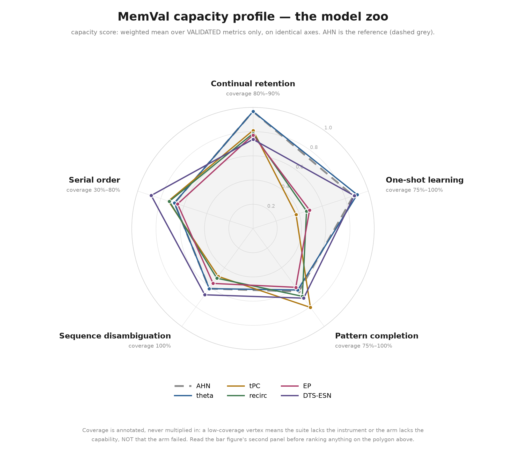
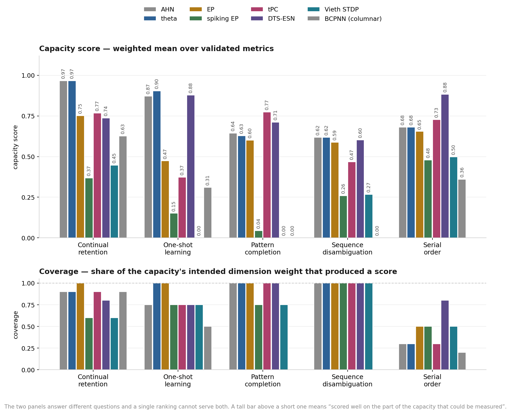
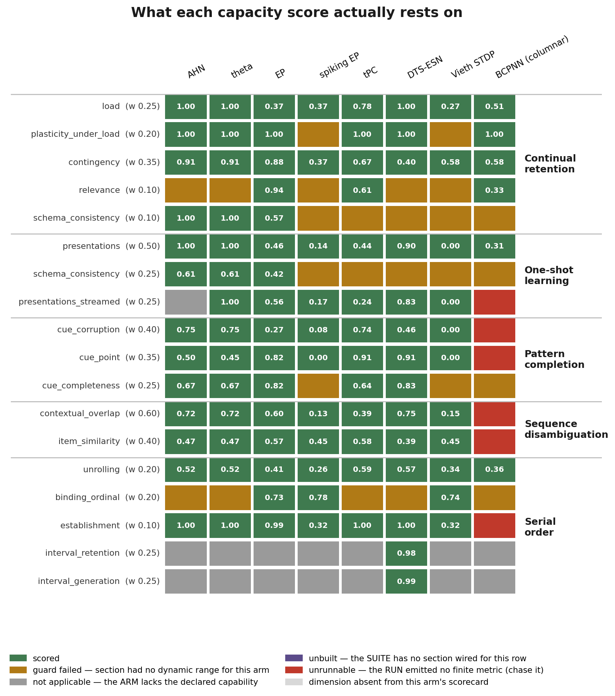
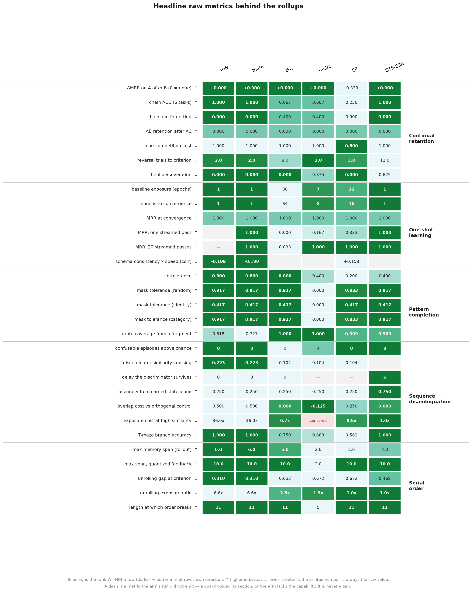

# MemVal capacity report — the model zoo

**Run 2026-09-03.** Every arm the user named, put through the same capacity
scorecard that `docs/reports/capacity_report_ahn.md` established on
`AsymmetricHopfieldNetwork`: the spatial suite, the symbolic suite, the streamed
regime, the focused-protocol schema re-run, the serial-order probe, then
`bin/score_capacities.py` and `bin/build_scorecard_page.py`.

Read this against, in order:
- `docs/capacities/capacity_questions.md` — the five capacities as questions, the dimension
  each question manipulates, and the capability tags.
- `docs/reports/capacity_report_ahn.md` — the reference run and the runbook this one
  automates.
- `results/zoo_capacity_run/<ClassName>/capacity_scorecard.md` — the
  auto-generated per-metric scorecard for each arm.

**Everything below was produced in one batch from one checkout**, including a
fresh AHN run, so no number here is compared across code versions. The published
AHN run in `results/ahn_capacity_run/` is left untouched as the historical
reference; §2 says where the two disagree and why.

> **Roster cut, 2026-09-27.** The spiking arms (spiking EP, Vieth STDP, BCPNN)
> and the ca3net port were retired. Their arm sections, their results and their
> code are at git tag `archive/pre-cleanup`. The §1 protocol fixes they prompted
> are kept, because the fixes still apply to every arm. `_compare/` and
> `index.html` were rebuilt over the six kept arms, which now include Chen
> recirculation (`predictive_recirculation`, added 2026-09-08, after this report
> was written).

---

## 0. What was asked, and what is here

| arm requested | `--model` | status |
|---|---|---|
| EP | `original_eqprop` | ran — see §5 |
| theta (Hasselmo) | `theta` | ran — **had to be registered first** |
| tPC | `temporal_pc` | ran |
| DTS-ESN reservoir | `dts_esn` | ran |
| Chen recirculation *(added 2026-09-08)* | `predictive_recirculation` | added after this report; scorecard in `results/zoo_capacity_run/PredictiveRecirculationNetwork/` |

"EP" is read as `original_eqprop`, the clean EP baseline the retention work
builds on. The toy `eqprop` variant and the DG/XdG/EWC mitigations on top of
original EP are a different question (the mitigation ladder) and are not in
scope here.

`ahn` (registry key `hopfield` at the time) is re-run alongside as the reference line on every figure.

---

## 1. Changes this run required

Thirteen things had to change (1.12 and 1.13 came from adding the seventh arm). Two are registry gaps (1.1, 1.5); eight are
defects, and seven of those eight were **silently mis-reporting something other
than the arm's capability as a measurement** — the failure mode the scorecard
exists to make impossible. One (1.9) is a performance change. All of them were
found by running arms the suite had not been run against before; none required a
new kind of test, only a new arm.

Two are worth reading even if you skip the rest, because they were each worth
more than any effect the run measures: **1.10** (a call-level `epochs=` silently
discarded by nine of thirteen arms, worth 100× on one section) and **1.11** (an
input mapping that floored an arm at chance regardless of training).

### 1.1 `theta` and `spiking_eqprop` were not reachable

`ThetaPhaseSequenceNetwork` and `SpikingEqPropSequenceNetwork` were implemented,
tested and demoed, and both are exported from
`memval/models/baselines/__init__.py` — but neither appeared in
`MODEL_REGISTRY`, so no pipeline could construct them. Both are now registered
(`bin/run_benchmark.py`), with the kwargs and the reasoning recorded inline at
each entry. The same oversight that hid tPC and DTS-ESN until 2026-09-03.

### 1.2 `bin/probe_serial_order.py` hard-coded AHN

The AHN runbook lists the serial-order probe as a per-arm step, but the script
imported `AsymmetricHopfieldNetwork` directly and stamped that name into its
output. It now takes `--model` from the registry.

Its `--epochs` default changed from a fixed `300` to **the arm's own registry
`n_epochs`**. That matters: registry defaults span 1 to 300 across the
taxonomy, so a single shared number puts every arm at a different place on its
learning curve — the confound the probe's own docstring warns about. The
staircase rows (`unrolling_gap`, `unrolling_exposure_ratio`) are unaffected;
they are self-referenced by construction. Re-running AHN through the new code
path reproduces the stored `serial_order_probe.json` summary exactly.

### 1.3 `tmaze_completion` crashed for any arm declaring `n_hidden`

`spatial_pipeline.py` built the section's model as
`model_class(n_features=..., n_hidden=1024, **kw)`. For tPC — whose registry
entry sets `n_hidden=128` — that raised
`TypeError: got multiple values for keyword argument 'n_hidden'`, which the
section's surrounding `try/except` converted into a **silent** section-wide
`nan`. The effect on the scorecard: tPC's entire `cue_point` dimension (weight
0.35 of Pattern completion) reported `unrunnable`, and Pattern completion scored
0.534 at 65% coverage.

Now `kw.setdefault("n_hidden", 1024)` — an arm that declares a width keeps it,
and arms without the kwarg are bit-identical to before. With the fix, tPC's
Pattern completion is **0.665 at 100% coverage** and Serial order rises 0.589 →
0.626.

This is the failure mode worth generalising: a broad `except` around a section
turns a construction bug into a missing capability. The `unrunnable` status
exists to surface exactly that, and it should be chased, never reported.

### 1.4 Two arms silently ignored the constructor `n_epochs` — the reversal confound

`SpatialReversalBenchmark`'s exposure contract is stated in its own docstring:

> A **trial is one presentation** — a single `fit_sequence` call. The
> epochs-per-presentation is whatever the model was constructed with, held equal
> across arms.

The section constructs every arm with `n_epochs=3` and then calls
`model.fit_sequence(train_seq)` with no `epochs` argument. **Eleven of the
thirteen registered arms store the constructor value and honour it. Two did
not** — `AsymmetricHopfieldNetwork` and `DTSESNSequenceNetwork` dropped it into
`**kwargs` and fell back to their signature default of 1.

So those two arms trained **one epoch per trial where the section asked for
three**, on the exact section whose headline metric is *trials to criterion*.
Both now store `n_epochs` and use it as the `fit_sequence` default; an explicit
`epochs=` still wins, so every other section — all of which pass `epochs=`
explicitly — is bit-identical. `novelty.py` shares the bare-call pattern but is
not wired into any suite.

What it was worth, on AHN:

| metric | published (1 epoch/trial) | corrected (3 epochs/trial) |
|---|---:|---:|
| `reversal_direct_reversal_trials_to_criterion` | 5.0 | **2.0** |
| `reversal_direct_reversal_final_goal_identity_margin` | 0.546 | 0.749 |
| `reversal_direct_reversal_final_anticipation_lead` | 2.0 | 1.0 |
| `extinction_reward_drop_fraction` | 0.721 | 0.431 |

Continual retention moves 0.957 → 0.960. The number to retire is the AHN
report's "**Reversal: 5 trials to criterion**"; at the exposure the section
actually specifies it is **2**.

DTS-ESN's reversal stays censored at the 12-trial ceiling with the correction
(perseveration 0.875 → 0.625), so its failure there is a real result, not an
exposure artefact.

### 1.5 EP arms were excluded from the streamed regime by their modality list

`original_eqprop` and `spiking_eqprop` both declare `OnlineTrainable`, which is
what capacity question 2.3 is tagged on, but their `modalities` lists omitted
`online_symbolic` — so the question came out as a missing instrument rather than
as a result. `online_symbolic` added to both. The pipeline already gates on
`supports_online()` and writes `status: not_applicable`, so the modality list was
the only thing withholding the run.

### 1.6 The serial-order staircase trained 100 epochs per "one-epoch" step for every EP arm

`epochs_to_criterion`'s contract is explicit: `fit(model, epochs)` "trains for
exactly `epochs` passes." But **nine of the thirteen registered arms — the whole
EP family — declare `fit_sequence(self, sequence_data, **kwargs)` and loop over
`self.n_epochs`**, so a call-level `epochs=` lands in `**kwargs` and is
discarded:

| honours `epochs=` | ignores it, uses `self.n_epochs` |
|---|---|
| `hopfield`, `theta`, `temporal_pc`, `dts_esn` | `eqprop`, `original_eqprop`, `dg_original_eqprop`, `dg_xdg_eqprop`, `ewc_dg_xdg_eqprop`, `ewc_original_eqprop`, `dg_eqprop`, `ewc_dg_eqprop`, `spiking_eqprop` |

Every `fit` closure in `symbolic_pipeline.py` and `spatial_pipeline.py` already
guards against this — they assign `m.n_epochs = ep` before the call — **so the
suites are correct**. `bin/probe_serial_order.py`'s staircase did not. Each step
that believed it was adding one epoch was running `self.n_epochs` (100) instead,
so for every EP arm `E_cued` and `E_roll` were in units of 100 epochs while the
other four arms' were in units of 1 — the exact cross-arm confound that
staircase exists to remove. It also cost ~100× the wall-clock: the first EP
probe ran 17 minutes without finishing and was projected at ~98.

Both call sites in the probe now pin the count on the instance as well as
passing it. AHN re-run through the fixed path reproduces the published
`serial_order_probe.json` summary **identically**, as do the other three arms
that honoured the kwarg all along.

The scored metrics mostly survive this, which is why it was not visible in the
numbers: `unrolling_exposure_ratio` is `E_roll / E_cued`, so a constant factor
cancels, and `unrolling_gap` is read *at* `E_cued` whatever that is. It is the
absolute step counts, and the wall-clock, that were wrong.

### 1.7 Catastrophic forgetting was scoring a perfect 1.0

`symbolic_pipeline.py` emits `delta_mrr_forgetting = mrr_after - mrr_before`, so
**negative means forgetting**. `bin/score_capacities.py` classified it with the
note "MRR(before) - MRR(after)" — the opposite sign — and normalised it with
`lo`, i.e. `n = clip(1 - x)`.

For EP's −0.606 that is `1 - (-0.606) = 1.606`, **clipped to 1.0**. The arm with
the worst catastrophic interference in the run scored full marks on the one
metric named after it, at double weight, identically to the arms with zero
forgetting. `lo` cannot score this quantity and neither can `hi` (which would
give perfect retention a 0.0), so the fix is a normaliser that respects the
sign:

```python
def signed_drop(x):        # -1 -> 0.0,  0 -> 1.0,  positive clipped to 1.0
    return _clip(1.0 + x)
```

| arm | raw | old `n` | new `n` | `load` dimension | Continual retention |
|---|---:|---:|---:|---:|---:|
| AHN / theta / DTS-ESN | +0.000 | 1.000 | 1.000 | 1.000 | unchanged |
| tPC | +0.061 | 0.939 | 1.000 | 0.960 → 0.972 | 0.833 → **0.837** |
| EP | −0.606 | **1.000** | **0.394** | 0.415 → **0.294** | 0.709 → **0.675** |

The bug was partly masked because `load` averages five metrics and EP's other
four (chain accuracy 0.281, chain forgetting 0.775, retention ratio 0.277) were
already dragging it down — which is exactly why it survived the AHN reference
run: **on an arm that does not forget, a normaliser for forgetting is
untestable.** It took an arm that fails the axis to expose the scorer for that
axis. The same figure convention was wrong in the comparison plot, which shaded
EP's −0.606 as the best value in its row; both are fixed.

### 1.8 The suite was not reproducible

Two independent causes, both in `semantic_similarity`, plus one in
`presentation_duration`. Full diagnosis, measurements and the fix in **§4.2** —
it is a finding about the benchmark rather than a build detail. Summary: a
vocabulary built from `set(...)` made a *seeded* encoder deal different vectors
to different words on every process, and the section never pinned the global
numpy stream its probe noise comes from. The symbolic and spatial suites are now
bit-reproducible across `PYTHONHASHSEED`, guarded by
`tests/test_encoder_order_stability.py`.

### 1.9 `spiking_eqprop` probes one cue at a time — a 29× tax it did not need to pay

The arm's first attempt at the symbolic suite was killed after **56 minutes of
CPU with four of ten sections done**, and was projected at several hours. That is
not the learning rule: it is the probe path. `predict_next` clamps one cue and
runs a 100-tick free-phase settle, and `measure_recall_associative` calls it once
per (trial, position) — a 30-trial probe on an 11-item list is **300 separate
100-step settles**.

Every tick is a handful of torch ops whose cost is dominated by per-call
overhead, not by tensor width, and the settles are independent by construction
(this is the one-step cued protocol; `_fresh_states` builds one layer state per
sample). So they batch:

| | 300 probes |
|---|---:|
| 300 separate `predict_next` calls | 4.12 s |
| one batched settle, N = 300 | 0.04 s |
| | **103×** |

The arm now exposes `predict_next_batch`, and both shared probe helpers take a
batched path when — and only when — an arm sets `batched_probe = True`:

- `measure_recall_associative` collects every (trial, position) cue and settles
  once.
- `measure_recall_autoregressive` advances all trials in lockstep, one batched
  settle per step. Trials are independent chains and noise enters only at step
  0, so this is a reordering of independent work, not an approximation.

Both build their cues by drawing noise in the **identical nested order** as the
serial loop, so the arm sees exactly the cues it would have seen. Verified
end-to-end on spiking EP: cued and rollout curves **bit-identical** between the
two paths, at **29× less wall-clock** on the probe path (the batches in a real
section are smaller than 300, hence 29× rather than 103×). Every arm without the
flag runs the original loop untouched, so this cannot move a number already
measured — the five arms in §3 were re-scored after the change and are unaffected.

`batched_probe` is opt-in and nominal rather than a `hasattr` check for a
reason: the batched rollout calls `reset_context` once for the batch instead of
once per trial, so it is only valid for an arm whose `predict_next` is pure —
which is the `HippocampalModel` contract, but a `StatePrimeable` arm must still
not declare it.

### 1.10 Nine of thirteen arms discarded a call-level `epochs=`

§1.6 found this in `bin/probe_serial_order.py` and fixed it there. That was
treating a symptom. The audit that should have followed it — every
`fit_sequence` call site in the suite — shows **13 of 26 pass `epochs=` without
also pinning `n_epochs` on the instance**, including `continual_chain` (×3),
`paired_associate`, both disambiguation sections and `symbolic_pipeline:489`.

The contract is stated in `epochs_to_criterion`: *"fit(model, epochs) — trains
for exactly `epochs` passes."* Nine arms broke it. The EP family declared
`fit_sequence(self, sequence_data, **kwargs)` and looped over `self.n_epochs`,
so the kwarg was discarded. `SpikingEqPropSequenceNetwork` was worse: it looked
the key up as `kwargs.get("n_epochs", ...)` while every caller passes `epochs=`,
so the lookup **always** missed.

`continual_chain` is where this bites hardest, because it steps **one epoch at a
time** (`epochs_per_step=1`, `max_epochs=512`) and probes after each step. Every
"one epoch" step ran the registry default of 100:

| | `fit_sequence(X, epochs=1)` |
|---|---:|
| `spiking_eqprop`, `self.n_epochs=100` | 2.496 s |
| `spiking_eqprop`, `self.n_epochs=1` | 0.024 s |
| | **103×** |

That is what made the section take 40 minutes instead of 2. It also means
`chain_epochs_to_criterion` was a count of *steps worth 100 epochs each* for the
EP family and a count of single epochs for everyone else — the exact cross-arm
confound criterion-referenced exposure exists to remove. EP's chain figure was
not 19.5 epochs; it was 1,950.

Fixed in the **arms**, not the 13 callers — `DGOriginalEqPropSequenceNetwork`
already read `kwargs.get("epochs", self.n_epochs)` correctly, and that pattern is
now in all of them. Guarded by `tests/test_epochs_kwarg_contract.py`, which
checks the property **behaviourally** on every registered arm: an earlier audit
inspected signatures for the string "epochs" and mis-classified `dg_original` —
which takes `**kwargs` but reads the key properly — as broken. Only running it
settles it.

What it moved: EP's Continual retention 0.675 → **0.645** (chain accuracy 0.281 →
0.222, and `chain_epochs_to_criterion` now reads a true 250), tPC 0.837 → 0.841,
DTS-ESN's One-shot 0.843 → 0.855. AHN and theta are unchanged — they honoured
the kwarg all along.

### 1.11 `spiking_eqprop` was floored by its input mapping, not by its budget

Chasing whether `EP_SYMBOLIC_MAX_EPOCHS = 2048` was too generous produced the
opposite finding. Upstream's own runs are **far larger** than ours:

| | upstream (`experiment_mnist_eqprop_torch`) | MemVal |
|---|---|---|
| `n_epochs` | 10 default, **25** in the MNIST variant | 100 |
| `minibatch_size` | **20**, over a 50–60k training set | full batch |
| updates per epoch | **~2,500–3,000** | **1** |
| **total weight updates** | **~62,000–75,000** | **100** (ceiling 2,048) |

An "epoch" is one pass over the training data in both, and both apply exactly one
update per `run_eqprop_training_update` call. What differs is that their dataset
divides into thousands of minibatches and ours is a single sequence of a handful
of transitions. So MemVal's `n_epochs` is really "number of full-batch gradient
steps", and reading our 100 as *more* training than the paper's 25 is backwards
by roughly 600×. (This is also the quantitative basis for `random_flip_beta =
False`: at 75,000 updates the sign noise averages out; at 100 it cannot.)

The settling budget is likewise not a spare knob — it is the paper's central
calibration, and their own ablation prices it:

| `n_negative` | `n_positive` | test error @ epoch 25 |
|---:|---:|---:|
| 20 | 4 | 6.20% |
| 50 | 20 | 4.68% |
| 100 | 20 | 3.25% |
| **100** | **50** | **2.58%** ← the setting we use |

(The paper's prose reads "the positive and negative phases to (100, 50)
respectively", which is backwards; the code — `add_variant(n_negative_steps=100,
n_positive_steps=50)` — is authoritative, and our assignment matches it.)

**The actual defect was `input_gain = 1.0`.** Upstream's inputs are MNIST pixels,
which already fill the neurons' `[0, 1]` domain and are close to binary. MemVal's
`SymbolicEncoder` emits **unit-norm** vectors, whose per-component magnitude
falls as `1/sqrt(n_features)`. At gain 1 a 100-dim embedding maps into
`u ∈ [0.15, 0.79]` — every neuron sees a near-constant 0.5 — and the arm sits at
chance for **any** budget:

| `input_gain` | clipped | MRR @ 64 updates |
|---:|---:|---|
| 1 | 0.0% | 0.167 — and 0.167 at 1, 2, 4 … 512 updates |
| 4 | 21.6% | 0.500 |
| 6 | 40.9% | 1.000 |
| **10** = `sqrt(100)` | 63.1% | **1.000** |
| 30 | 85.9% | 0.992 |

The default is now `sqrt(n_features)`, which makes the mapped signal
**dimension-invariant** (`gain × σ ≈ 1` at any embedding width) and sits
mid-plateau rather than on an edge. The resulting ~60% saturation is faithful
rather than pathological: it is the regime upstream trains in, since MNIST pixel
intensities are themselves mostly at the rails. Documented at all three places
the arm is configured — the module docstring, the `input_gain` parameter, and the
`MODEL_REGISTRY` entry.

With the gain fixed the arm reaches criterion in **32 updates** rather than
exhausting the 2,048 ladder, and the first three symbolic sections fell from
~12 minutes to **59 seconds**.

So: the budget was never too generous. The arm could not use it.

---

### 1.12 An arm that never learns was being paid for not forgetting

Adding `vieth_gaba_stdp` exposed the mirror of 1.7. Its continual chain never
left chance -- `chain_acquired` **False**, chain ACC 0.042 against chance 0.033
-- and yet the `load` dimension scored **0.41**: `chain_avg_forgetting` was
0.027 (lower-is-better, so ~0.97 credit) and `chain_retention_ratio` 0.27,
because there was nothing to forget. `chain_acquired` gated only
`plasticity_under_load`. The scorer now demotes the two chain *stability*
read-outs to `protocol_limited` when `chain_acquired` is False
(`gate_chain_readouts`, mirroring `gate_damage_readouts`); `chain_avg_accuracy`
is chance-normalised and stays scored. Metric-level rather than a dimension
guard because `load` also carries `multiple_sequences`, which has its own
before/after. Vieth's Continual retention 0.506 -> **0.447**; the other six
arms re-scored byte-identically, since all six acquire the chain. As with 1.7:
*on an arm that learns, a guard against not learning is untestable.*

### 1.13 `multiple_sequences` had one ingestion order, and for one arm it was the wrong one

The section trained A to criterion, then B to criterion, then read A: one
ingestion order. The Vieth arm sizes every assembly by how often its item
occurs in the stream (its paper, secs. 4.5-4.6), so a list presented alone
takes the whole excitatory population and the next list re-labels it. Its
paper only ever trains in random block order. Without a second order the
section could not tell "cannot hold two lists" from "cannot hold them in this
order".

An **interleaved** condition now runs alongside (added 2026-09-04): A and B as
one stream in seeded random block order, each list getting the same per-list
exposure as the blocked run, to a criterion on the *worse* list. It is a
condition inside the section, not a suite; the blocked keys are untouched and
reproduce byte-identically. Its read-outs are **diagnostics, not scores**
(decided 2026-09-05): interleaving is the easier protocol for every arm --
there is no "before" to forget from -- so scoring it would reward the easier
condition and move every profile. What the condition adds is the contrast,
`multiple_seq_blocking_cost = mrr_after(blocked) - mrr_A(interleaved)`. No
profile in §3 moved.

| arm | A after B, blocked | A, interleaved | B, interleaved | blocking cost |
|---|---|---|---|---|
| AHN / theta / DTS-ESN | 1.000 | 1.000 | 1.000 | 0.000 |
| tPC | 0.989 | 0.961 | 0.972 | +0.028 |
| EP | 0.306 | **0.922** | 0.817 | **-0.617** |
| spiking EP | 0.006 | **0.950** | 0.917 | **-0.944** |
| Vieth STDP | 0.000 | 0.000 | 0.167 | 0.000 |

Two results, neither the one the condition was built for. **The EP arms'
catastrophic forgetting is mostly an ingestion-order effect**: presented as
one stream they hold both lists at 0.92 and 0.95 on A, against 0.31 and 0.01
after blocked B. Their `delta_mrr_forgetting` of -0.62 and -0.95 is a fact
about blocked ingestion of a full-batch learner, not about capacity. (Neither
reached the interleaved criterion inside 512 epochs, so those are lower
bounds.) And **the Vieth arm does not hold the lists even interleaved on this
substrate**: A 0.000, B 0.167, censored at 512. The standalone that holds both
lists at 1.00 / 0.80 under interleaving uses one-hot material; on the suite's
dense `SymbolicEncoder` rows the arm cannot acquire one list, so ingestion
order never gets to matter. Its blocking cost is zero because both terms are
at floor -- a substrate finding, and it stays attributed as one.

**A reproducibility note that the merge exposed.** The side run's own blocked
re-measurement differed from the stored zoo numbers by up to 0.03 MRR on the
four arms with noisy probes (tPC, EP, spiking EP, Vieth; the three linear arms
reproduced exactly): `measure_recall_associative` draws its probe noise from
the global RNG, so a section-subset run does not see the same draws as the
full suite. The stored blocked numbers were kept and the contrast recomputed
against them. Same family as the semantic-similarity seeding defect.

## 2. Reproducing this

`bin/run_capacity_arm.sh` executes the AHN runbook end to end for one arm:

```bash
bin/run_capacity_arm.sh <model> <ClassName> results/zoo_capacity_run 30
```

It runs, in order, the spatial suite, the symbolic suite, the streamed regime,
the focused-protocol schema re-run into `<out>/_schema_focused`, the
serial-order probe, `score_capacities.py` and `build_scorecard_page.py`, timing
and logging each step under `<out>/_logs/` and continuing past a failed step
rather than aborting the arm.

The seven arms in this report (the seventh, `vieth_gaba_stdp`, was run on
2026-09-04 after the first six, on the same checkout plus the arm itself):

```bash
for spec in "hopfield AsymmetricHopfieldNetwork" \
            "theta ThetaPhaseSequenceNetwork" \
            "original_eqprop OriginalEqPropSequenceNetwork" \
            "spiking_eqprop SpikingEqPropSequenceNetwork" \
            "temporal_pc MultilayerTemporalPCNetwork" \
            "dts_esn DTSESNSequenceNetwork" \
            "vieth_gaba_stdp CodecViethNetwork"; do
  bin/run_capacity_arm.sh $spec results/zoo_capacity_run 30
done
```

Then the cross-arm figures:

```bash
python bin/compare_capacity_arms.py \
  --scorecard "AHN=results/zoo_capacity_run/AsymmetricHopfieldNetwork/capacity_scorecard.json" \
  --scorecard "theta=results/zoo_capacity_run/ThetaPhaseSequenceNetwork/capacity_scorecard.json" \
  --scorecard "EP=results/zoo_capacity_run/OriginalEqPropSequenceNetwork/capacity_scorecard.json" \
  --scorecard "spiking EP=results/zoo_capacity_run/SpikingEqPropSequenceNetwork/capacity_scorecard.json" \
  --scorecard "tPC=results/zoo_capacity_run/MultilayerTemporalPCNetwork/capacity_scorecard.json" \
  --scorecard "DTS-ESN=results/zoo_capacity_run/DTSESNSequenceNetwork/capacity_scorecard.json" \
  --scorecard "Vieth STDP=results/zoo_capacity_run/CodecViethNetwork/capacity_scorecard.json" \
  --out-dir results/zoo_capacity_run/_compare
```

The first `--scorecard` is drawn as the reference (dashed grey) on the radar.

### Capping exposure on a slow arm

`bin/run_capacity_arm.sh` forwards extra arguments to both suite runs, so a slow
arm can be given a lower staircase ceiling:

```bash
bin/run_capacity_arm.sh spiking_eqprop SpikingEqPropSequenceNetwork \
    results/zoo_capacity_run 30 \
    --benchmark-args symbolic_disambiguation:max_epochs=128
```

**Use `max_epochs=N`, not `epochs=N`.** They are different knobs and only one is
safe for this purpose:

| knob | effect | who it changes |
|---|---|---|
| `max_epochs=N` | lowers the **ceiling** of the criterion staircase; `exposure_mode` stays `criterion` | only arms that would have run past N — and those already report `criterion_reached: False` |
| `epochs=N` | pins a **fixed** budget; `exposure_mode` becomes `fixed` and the staircase does not run | **every** arm, including the ones that currently stop early |

`epochs=N` is for reproducing an old fixed-budget number, not for speed: on
`symbolic_disambiguation` it would retrain `hopfield` (which reaches criterion at
3 epochs), `dts_esn` (1) and `temporal_pc` (37) at N, changing results that are
currently correct.

Choose N above what the arms you still want measured actually need.
`original_eqprop` reaches this section's criterion at **347** epochs, so a cap of
128 would censor a measurement that presently succeeds — which is why the cap is
a per-arm argument and not a default.

**Where the time actually goes.** `symbolic_disambiguation` sweeps ~30 points
across seven axes (5 similarity rungs, 5 load counts, 4 zone fractions, 5 hold
delays, 4 support durations, 5 orthogonal controls, 2 middle conditions) and
trains every one to criterion. On an arm that never reaches it, every point
spends the full ceiling. On `spiking_eqprop` that single section took **34 of the
45 minutes** of its symbolic suite; the other nine sections together took 10.

**Wall-clock, 30 trials, 8-core M-series, six arms run concurrently:** AHN 81 s,
theta 81 s, DTS-ESN 176 s, tPC 439 s, `original_eqprop` 3,470 s,
`spiking_eqprop` 3,570 s, `vieth_gaba_stdp` 2,607 s (run alone). The two EP arms and Vieth are ~40× the others, and within them
one section dominates: `symbolic_disambiguation` took **34 of spiking's 45
symbolic minutes**, the other nine sections 10 between them. See §2's exposure
cap for the lever, and §1.10 for the bug that used to make this far worse.

---

## 3. The profiles





<!-- PROFILE_TABLE -->
| arm | Continual<br>retention | One-shot<br>learning | Pattern<br>completion | Sequence<br>disambiguation | Serial<br>order |
|---|---|---|---|---|---|
| `AHN (reference)` | **0.960**<br><sub>cov 90%</sub> | **0.868**<br><sub>cov 75%</sub> | **0.622**<br><sub>cov 100%</sub> | **0.599**<br><sub>cov 100%</sub> | **0.673**<br><sub>cov 30%</sub> |
| `theta` | **0.960**<br><sub>cov 90%</sub> | **0.901**<br><sub>cov 100%</sub> | **0.622**<br><sub>cov 100%</sub> | **0.599**<br><sub>cov 100%</sub> | **0.673**<br><sub>cov 30%</sub> |
| `EP` | **0.645**<br><sub>cov 90%</sub> | **0.350**<br><sub>cov 75%</sub> | **0.460**<br><sub>cov 100%</sub> | **0.540**<br><sub>cov 100%</sub> | **0.579**<br><sub>cov 50%</sub> |
| `spiking EP` | **0.458**<br><sub>cov 100%</sub> | **0.367**<br><sub>cov 100%</sub> | **0.152**<br><sub>cov 75%</sub> | **0.338**<br><sub>cov 100%</sub> | **0.534**<br><sub>cov 50%</sub> |
| `tPC` | **0.841**<br><sub>cov 80%</sub> | **0.347**<br><sub>cov 75%</sub> | **0.665**<br><sub>cov 100%</sub> | **0.564**<br><sub>cov 100%</sub> | **0.625**<br><sub>cov 30%</sub> |
| `DTS-ESN` | **0.764**<br><sub>cov 90%</sub> | **0.855**<br><sub>cov 100%</sub> | **0.710**<br><sub>cov 100%</sub> | **0.431**<br><sub>cov 100%</sub> | **0.870**<br><sub>cov 80%</sub> |
<!-- /PROFILE_TABLE -->

**Score and coverage are two numbers and must stay two numbers.** A high score
at low coverage is a claim about a fraction of the capacity. Serial order is the
sharpest case: it reads 30% for the four ordinal-clocked arms, 50% for the two EP
arms (which alone produce the cued failures `binding_ordinal` needs) and **80%
for DTS-ESN**, the only arm that can be asked the ⏱ half at all. Those three
numbers are not the same measurement, and the scores above them are not
comparable without saying so — see §4.6.

### What each capacity score rests on



This is the figure to read before any ranking. The same capacity number rests on
four dimensions for one arm and two for another, and the four non-scored statuses
are four different claims:

| status | what it says | whose property |
|---|---|---|
| `scored` | the dimension produced a number | — |
| `unresolved` | a guard failed: the section ran, but its manipulation had no dynamic range for this arm | the **instrument**, on this arm |
| `not_applicable` | the arm does not declare the capability the row needs | the **arm** |
| `unbuilt` | MemVal has no section wired for this row | the **suite**, identically for every arm |
| `unrunnable` | the feeding section emitted no finite metric | the **run** — chase it, never report it |

Only `unbuilt` and `not_applicable` are stable facts. `unresolved` is a
statement about where an arm sits relative to the instrument's range, and it
cuts both ways. `binding_ordinal` (weight 0.20 of Serial order) is the clearest
case: `failures_observed` is False for AHN, theta, tPC and DTS-ESN — 900 cued
probes each, **zero failures** — so every metric in that dimension, each of
which is a conditional on an error, is undefined rather than zero, and the
dimension is excluded. Those arms sit *above* the instrument's range; the
length grid never reaches the point where their cued order breaks.

**EP is the exception, and it is why its Serial-order coverage is 50% where
everyone else's is 30%.** It produces 364 cued failures, so the dimension is
scorable for it alone. The same asymmetry appears in `relevance` (§4.5). Two of
the five capacities contain a dimension that can only be measured on an arm that
fails the dimension above it.

### The raw metrics behind the rollups




---

## 4. Seven findings that cut across the arms

### 4.1 theta and AHN are the same model, and the suite proves it

At the paper's optimal phases (`phi_EC = phi_LTP = 0`, `phi_CA3 = pi`, `X = 1`)
the theta cycle integral reduces analytically to `(x_next - W x_cur) x_cur^T` —
the delta rule — so `ThetaPhaseSequenceNetwork` and `AsymmetricHopfieldNetwork`
take *identical* weight steps at the same learning rate. Direct check: after
three fits, `max|W_AHN - W_theta| = 1.4e-17` and `max|pred_AHN - pred_theta| =
2.1e-17`. The measured phase coefficients are `encode = +1.000`,
`retrieve = -1.000`, `residual = -1.1e-16`.

Run through the whole scorecard, **359 of 361 metrics agree**. Both exceptions
are `semantic_similarity` (§4.2). Every capacity score matches to four decimals
except One-shot learning, where theta scores higher **only because it has more
coverage** — it declares `OnlineTrainable` and so answers question 2.3, which
AHN cannot be asked at all.

This is the most useful thing in the run and it is not a result about theta. It
is a **control on the instrument**: two arms that provably compute the same
thing produce the same profile, so a difference elsewhere on these axes is a
difference in the model rather than in the harness. It is also what made the
reversal bug (§1.4) visible — the pair disagreed on exactly one section, which
is a much louder signal than either arm's number would have been alone.

Note what the pair does *not* establish. It says the two error derivations
(explicit subtraction vs oscillatory phase separation) are equivalent *at the
paper's optimum*. `modulation_depth` and the two phase offsets are free
parameters that MemVal never sweeps; the fornix-lesion control (`X = 0`) and the
Figure-4 phase surface are the interesting part of that arm, and no suite
section touches them.

### 4.2 The suite was not reproducible, for two reasons, and now is

`semantic_similarity` was the only section whose numbers moved between identical
runs. Seven full-suite runs of the **same learning rule** (four AHN, three theta
— provably the same model, §4.1) gave `epochs_to_criterion` at the hardest rung
of `33 37 41 45 46 47 64` (median 45, 1.9×), and the rung's own
`cosine_similarity` moved with it (0.787–0.798), so the sweep was not even
measuring at a fixed point on its own axis. `similarity_exposure_cost` feeds
`item_similarity`, **weight 0.40 of Sequence disambiguation**.

The first diagnosis — an unseeded RNG — was wrong. `SymbolicEncoder` was seeded
throughout. There were two independent causes.

**1. A hash-ordered vocabulary.** `SymbolicEncoder` draws **one RNG sample per
word, in the mapping's iteration order**, so a seeded encoder is reproducible
only if the mapping it is handed is order-stable. The section built

```python
sim_vocab = {w: vocab[w] for w in set(list_high + list_low)}
```

and `set` iteration order depends on `PYTHONHASHSEED`, which CPython randomises
per process — so every run dealt the same seeded vectors out to different words.
Measured, same seed, `category_variance=0.05`:

| `PYTHONHASHSEED` | `set(...)` | `dict.fromkeys(...)` |
|---|---:|---:|
| 1 | 0.785627 | 0.790832 |
| 2 | 0.789515 | 0.790832 |
| 3 | 0.793455 | 0.790832 |
| 4 | 0.790529 | 0.790832 |

Fixed with `dict.fromkeys`, and the ordering contract is now documented on
`SymbolicEncoder.__init__`. It was the only call site in the codebase building a
vocabulary from an unordered collection; every other one iterates a list or the
vocab JSON.

**2. Unseeded probe noise.** `measure_recall_associative` draws its cue noise
from the **legacy global numpy stream**. Four sections already pin it —
`cue_masking`, `paired_associate`, `continual_chain`, `schema_consistency` — and
`semantic_similarity` did not. It mattered here more than it would elsewhere
because the scored read-out is epochs-to-criterion, a **step function of a noisy
score**: at the hardest rung the crossing sits exactly where the noise lives, so
a draw worth a hundredth of MRR moves the reported exposure by tens of epochs.
Seeded **per rung**, not once per section — the staircase probes once per
checkpoint, so a single shared stream would make each rung's noise depend on how
long the *previous* rung took to converge, which is the coupling that turns
"harder rung" into "different noise".

**Scope note.** The ask was `semantic_similarity`. After fixing it,
`presentation_duration` was the only symbolic metric still moving
(`convergence_span` flipped 6/5/6 across three AHN runs), so it was seeded too —
the same one line. Leaving exactly one stochastic metric in an otherwise
deterministic suite is the hardest state to reason about. Nothing else was
touched.

**Verified.** Three full symbolic runs at different `PYTHONHASHSEED` values:
**228 metrics and every series bit-identical**. Spatial likewise (100 metrics).
`tests/test_encoder_order_stability.py` guards both invariants by running the
real section in fresh interpreters under several hash seeds — the only way to
exercise it, since within one process the ordering is fixed and everything looks
reproducible.

**What changed in the numbers.** The seeded value at the hardest rung is **44
epochs**, near the old median of 45 — the distribution was centred, not biased.
The confirmation worth having is that AHN and theta, which take provably
identical weight steps, now return **identical** `epochs_to_criterion`
(`[44, 7, 1, 1, 1]`) where before they read 33 and 46. That was the last
disagreement between them, so §4.1's controlled pair is now exact on every
symbolic metric. Any `similarity_exposure_cost` recorded before 2026-09-04 —
including the AHN report's "59× exposure at cosine 0.80" — is one draw from the
old distribution and should not be quoted.

### 4.3 Only the reservoir holds a discriminator across a delay

Capacity question 4.3 — *can the memory hold the distinguishing signal across a
stretch where it is no longer present?* — is tagged ⚑ `StatePrimeable`, and the
AHN report records it as a protocol floor for every arm. It is not:

| | AHN | theta | EP | spiking EP | tPC | DTS-ESN |
|---|---:|---:|---:|---:|---:|---:|
| `symdis_state_primed` | False | False | False | False | **True** | **True** |
| withdrawn-divergence accuracy | 0.250 | 0.250 | 0.250 | 0.250 | 0.250 | 1.000 |
| accuracy from carried state alone | 0.250 | 0.250 | 0.250 | 0.250 | 0.250 | 0.750 |
| delay the discriminator survives | 0 | 0 | n/a | n/a | 0 | 6 |

The clean part is the tPC column. tPC **declares `StatePrimeable`, the priming
path fires for it** (`symdis_state_primed = True`), and it still floors at
chance with the most negative margin of any arm. So the declaration is
necessary and not sufficient: `observe` moves tPC's latent, and a following
`predict_next` reads it, but what the latent carries is not the discriminator.
For the four arms that do not declare it, the row remains a protocol finding.
For tPC it is a model result. (EP and spiking EP read `n/a` on the delay row
rather than 0: `symdis_support_needed` is undefined for them because they never
reached the fixed-support criterion the delay is measured at, so the row is
excluded rather than floored.)

DTS-ESN is at ceiling on this row after **one exposure**, and holds the signal
across six shared steps. That is the reservoir's fixed high-dimensional
dynamics doing what they are for, and it is the strongest single result in the
run.

### 4.4 Cue corruption and cue point are different capabilities, and they dissociate

Pattern completion's two probe dimensions order the arms in **opposite
directions**:

| | AHN / theta | EP | spiking EP | tPC | DTS-ESN |
|---|---:|---:|---:|---:|---:|
| σ-tolerance (`cue_corruption`) | 0.800 | 0.100 | 0.200 | 0.400 | 0.400 |
| route coverage from a fragment (`cue_point`) | 0.727 | 0.909 | 0.000 | 0.909 | 0.909 |
| step at which the route is lost (of 11) | 2 | 8 | 0 | 10 | 10 |

Spiking EP's 0.000 is not a tie with anything — `tmaze_pc_criterion_reached` is
False, so it never learned the route to begin with and the row is a floor, not a
completion failure.

The one-matrix associators tolerate four times as much noise on a single cue and
then lose the route at step 2 of 11. The state-carrying and hidden-layer arms
tolerate a quarter to half as much noise and track the route almost to the end.
Averaging these into one "pattern completion" number would hide the entire
effect; they are weighted 0.40 and 0.35 of that capacity precisely so that it
cannot.

### 4.5 The selective-retention instrument only has range on an arm that forgets

`select_under_pressure` — question 1.4, *does the memory keep what is still in
use?* — guard-fails for AHN, theta, tPC and DTS-ESN, all for the same reason:
the 6-task chain never saturates them, so there is no capacity pressure to be
selective under. It passes for **EP and spiking EP** — the two arms whose chain
collapses — and there the instrument reads `select_selectivity` 0.725 for EP.

`binding_ordinal` (Serial order, weight 0.20) behaves identically:
`failures_observed` is False for the four arms that retain — 900 cued probes,
zero failures — so every metric in it is a conditional on an error that never
happened. It is True only for EP (364 failures) and spiking EP (533), which is
why those two have **50% Serial-order coverage against everyone else's 30%**.

That is a property of the instrument worth stating plainly: **two of the five
capacities contain a dimension that can only be measured on an arm that fails
the dimension above it.** Their weight leaves the coverage of every arm that
retains, and the only numbers they produce come from the arms with the least to
keep.

### 4.6 Serial order's metric-time half, measured for the first time

`interval_retention` (5.4) and `interval_generation` (5.5) carry **half of Serial
order's weight** and were `unbuilt` — no section existed, for any arm. Both are
now wired (`memval/benchmarks/interval_timing.py`), gated on a **declared**
capability: 5.4 on `TemporallyClocked`, 5.5 on the strictly stronger
`TimingPredictive`. Only `DTSESNSequenceNetwork` declares either, so it is the
only arm that runs them; the rest are skipped and scored *not applicable* rather
than floored.

The gate is nominal rather than duck-typed for a concrete reason, which
`tests/test_interval_timing.py` demonstrates rather than asserts:
`AsymmetricHopfieldNetwork.fit_sequence` takes `**kwargs` and **accepts
`intervals=[...]` without error while remaining clocked by ordinal** — the test
trains it with and without gaps and shows the weights are identical. A signature
check would have run the section on it and scored the resulting floor as a model
failure.

What DTS-ESN does with them:

| | | |
|---|---:|---|
| `interval_discrimination_acc` | **1.00** | right continuation for the right gap |
| `interval_control_acc` | **0.00** | the same arm, same stream, **gaps removed** |
| `interval_encoded` | 0.91 | the gap changed the answer across the sweep |
| `interval_switch_sharpness` | 1.00 | one clean crossing, not a drift |
| `interval_crossing_gap` | 2.45 s | between the trained 1 s and 8 s |
| `tempo_reproduction_error` | 0.025 | 2.5% relative, over both tempos |
| `rhythm_pause_position_acc` | 1.00 | the pause put back in the right place |
| `peak_time_error` | 0.008 | time-to-next-event, teacher-forced |

**The control is the point.** 1.00 against 0.00 for an ordinal twin trained on the
identical event stream through the identical code path is what makes the first
row mean "elapsed time was absorbed" rather than "the two continuations happened
to differ". Generated rhythm was `[0.5, 0.5, 2.97, 0.51, 0.5]` against a trained
`[0.5, 0.5, 3.0, 0.5, 0.5]`.

The second control belongs to the design rather than the arm: run the timing head
on 5.4's *ambiguous* stream, where the gap is not determined by the items, and
the prediction collapses to **4.48 s** against a mean of 4.5 for trained gaps of
1 and 8 (`interval_ambiguous_gap_collapse` 0.99). A gap that carries information
cannot also be predictable from the items — which is why these are two sections
and not two read-outs of one.

Serial order for DTS-ESN moves **0.683 at 30% coverage → 0.870 at 80%**. The
missing 20% is `binding_ordinal`: it produces zero cued failures, so the
dimension is undefined rather than zero (§4.5). No other arm's numbers change —
their interval rows move from `unbuilt` to `not_applicable`, which is the same
exclusion for a better-stated reason: the gap was in the **suite**, and now it is
in the **arm**.

**A harder rhythm, across seeds (standalone probe, not scored).**
`bin/interval_generation_abcd.py` re-runs the 5.5 protocol on one custom stream,
A →1.2 s→ B →10 s→ C →1.2 s→ D, a long pause between two short gaps. It uses the
section's conventions unchanged (zoo ESN parameters, `n_reps=40`, autonomous
`generate()` from A with codebook cleanup on the fed-back item) but is not wired
into the suite, so none of this enters the scorecard. Five seeds, each moving
both the item embeddings and the reservoir
(`results/zoo_capacity_run/DTSESNSequenceNetwork/interval_generation_abcd/plots/interval_generation_abcd_seeds.png`,
listed in the zoo index under the ESN's standalone sections):

| seed | A→B (1.2 s) | B→C (10 s) | C→D (1.2 s) | items | mean rel. error |
|---:|---:|---:|---:|---:|---:|
| 42 | 1.235 | 9.892 | 1.215 | 3/3 | 0.0175 |
| 43 | 1.199 | 9.905 | 1.243 | 3/3 | 0.0153 |
| 44 | 1.200 | 9.918 | 1.213 | 3/3 | 0.0063 |
| 45 | 1.210 | 9.908 | 1.236 | 3/3 | 0.0158 |
| 46 | 1.222 | 9.911 | 1.210 | 3/3 | 0.0119 |
| **mean ± SD** | **1.213 ± 0.015** | **9.907 ± 0.009** | **1.223 ± 0.015** | **1.00** | **0.013 ± 0.004** |

Every seed produces the right items and puts the long pause in the right place.
The 10 s gap comes out **short on all five seeds** (9.89–9.92 s, −0.9% on
average), so that is a bias of the timing head, not seed noise. The short gaps
run slightly long instead: 1.199–1.243 s, eight of ten above target, at most +3.6%. The generated gaps match the teacher-forced
`predict_time_to_next` read-out to within 0.001 s (`peak_time_error` 0.013 ±
0.004 against `tempo_reproduction_error` 0.013 ± 0.004): with the codebook
cleanup the rollout never drifts, so the error is the head's, not the unroll's —
and for the same reason item accuracy 1.00 is partly the harness's, not the
arm's. The single-seed figure that circulated earlier is seed 42, the worst of
the five.

One caveat carried in the section's own docstring: both run at a **fixed**
exposure (`n_reps=40`) rather than a criterion staircase. With one eligible arm
there is no cross-arm learning-curve confound to create, but the moment a second
time-clocked arm exists this must become criterion-referenced like everything
else.

### 4.7 Exposure separates the arms by two orders of magnitude, and the ratios are what transfer

Every section trains to a criterion and reports the cost. Baseline exposure, and
what each section then needed:

| section | AHN | theta | DTS-ESN | tPC | EP | spiking EP |
|---|---:|---:|---:|---:|---:|---:|
| `exposure_baseline_epochs` | 1 | 1 | 1 | 43 | 110 | 11 |
| `continual_chain` | 1 | 1 | 1 | 40 | 250 | 279 |
| `noise_invariance` | 1 | 1 | 1 | 43 | 110 | 11 |
| `cue_masking` | 1 | 1 | 1 | 49 | 37 | 512 |
| `symbolic_disambiguation` | 3 | 3 | 1 | 37 | 347 | 512 |
| `tmaze_completion` | 2 | 2 | 1 | 60 | 23 | 512 |

`exposure_within_band` (the 8× guard) holds for five of six arms, so their
sections are comparable *within* each arm. **It fails for spiking EP**, whose
`cue_masking` sits **46.5×** its own baseline (11 epochs baseline against a
censored 512): its sections were not trained at like-for-like exposure, and
cross-section statements about that arm — "it completes but does not retain" —
are not supported by this run. The guard exists to say so out loud rather than
let the comparison pass silently.

Across arms only the self-referenced ratios transfer —
`unrolling_exposure_ratio`, `similarity_exposure_cost`,
`*_exposure_vs_baseline` — which is exactly what the criterion-referenced
exposure policy was built for.

The schema section is where this bites. Its budget is denominated in **trials**,
not epochs, and both slow arms hit its floor: tPC and EP reach
`new_item_recall = 0.00` on every rung inside the 4-trial budget, so
`schema_resolved` fails and the dimension is voided for both — in *two*
capacities (1.5 at weight 0.10, and 2.2 at weight 0.25 of One-shot learning,
which is why tPC's One-shot coverage is 75%). That is not a finding about
schema-guided acquisition in slow arms; it is the section's exposure budget
being the one that did not get converted to a criterion.

---

## 5. Arm by arm

Each arm's own scorecard (`capacity_scorecard.md`), interactive page
(`capacity_scorecard.html`), radar and section plots are under
`results/zoo_capacity_run/<ClassName>/`.

### theta — `ThetaPhaseSequenceNetwork` (Hasselmo, Bodelon & Wyble 2002)

**Profile: 0.960 / 0.901 / 0.622 / 0.599 / 0.673.** Identical to the AHN
reference everywhere it can be (§4.1), and higher on One-shot learning only
because it covers 100% of that capacity rather than 75% — it declares
`OnlineTrainable`, so question 2.3 is asked and answered: **MRR 1.000 from a
single streamed pass**, and 1.000 at 5 and 20 passes.

Reversal at the section's own exposure: **2 trials to criterion, final
perseveration 0.000**, `goal_identity_margin` 0.749. Read this as one arm, not
two: AHN posts the same numbers once it trains at the exposure the section
specifies.

What this run does *not* test is the part of the paper that is actually about
theta. `modulation_depth` (the fornix-lesion control, `X = 0`) and the
independent `phi_LTP - phi_EC` / `phi_LTP - phi_CA3` surface are free parameters
no section sweeps, so the arm's whole claim — that reversal depends on the phase
relationship — is untouched by the scorecard. Registering it was worth doing for
the control it provides; getting a *result* out of it needs a section that
sweeps `modulation_depth`.

### tPC — `MultilayerTemporalPCNetwork` (Tang, Barron & Bogacz 2023)

**Profile: 0.841 / 0.347 / 0.665 / 0.564 / 0.625.**

The One-shot number is the one to read carefully, and it is largely about
exposure rather than capability. tPC's baseline exposure is **43 epochs** where
the associators need 1, and two of that capacity's three dimensions punish it
directly: `presentations` scores 0.44 because convergence takes 64 epochs, and
`presentations_streamed` scores 0.18 because one streamed pass yields MRR 0.128
(0.394 at 20 passes). The third, `schema_consistency`, is **voided** — tPC
reaches `new_item_recall = 0.00` on all four rungs inside the section's 4-trial
budget (§4.6), which is why its coverage is 75%.

Retention is genuinely good: chain ACC 0.933 over six tasks with avg forgetting
0.038, `delta_mrr_forgetting` **+0.061** (recall on A was marginally *higher*
after B, not lower), `chain_retention_ratio` 0.973. Not the flat
1.000 of the linear stores, but nothing like EP.

On Pattern completion it sits on the state-carrying side of the §4.4
dissociation: σ-tolerance 0.400 against AHN's 0.800, but route coverage 0.909 to
step 10 of 11 with open-loop MSE 0.006 (AHN 0.024). Its in-bound masking margins
are an order of magnitude thinner than everyone else's
(`mask_random_margin_in_bound` 0.017 vs 0.146–0.219) — it gets the right answer
with almost nothing to spare, which is the margin doing what §4 of the AHN
report says it does.

Its `StatePrimeable` declaration is real and fires, and it still floors on the
withdrawn-discriminator row with the most negative margin in the run (§4.3).

### DTS-ESN — `DTSESNSequenceNetwork`

**Profile: 0.764 / 0.855 / 0.710 / 0.431 / 0.870.** Best Pattern completion and,
by a wide margin, best Serial order in the run; worst Sequence disambiguation. Both extremes are
informative.

**It holds a discriminator across six shared steps after one exposure** (§4.3) —
the only arm that does. And yet its Sequence disambiguation *score* is the
lowest, because `item_similarity` (weight 0.40) scores **0.00**: its
`symdis_similarity_tolerance_threshold` is censored, the crossing never
observed inside the sweep. The capacity's two dimensions are pulling in
opposite directions, and the rollup averages them. Read the dimension figure,
not the vertex.

Reversal is its clear failure, and the §1.4 correction does not rescue it:
**censored at the 12-trial ceiling** in both protocols, final perseveration
0.625 (0.875 before the correction). A frozen reservoir with an RLS readout
learns the new contingency without unlearning the old one. That is the single
place where its `plasticity` half of Continual retention collapses, and it is
what pulls that capacity to 0.764 despite a flat 1.000 chain.

Serial order: `unrolling_exposure_ratio` reads 1.00, which looks ideal and is
not. `rollout_criterion_reached` is **False** — the staircase reaches criterion
on rollout only at L = 3 and is censored at 5, 7, 9 and 11, so the ratio is
computed from the one length that finished. Its `max_memory_span` is 3.

Its ⏱ declarations (`TemporallyClocked`, `TimingPredictive`) are **no longer
unused** — this was the largest gap the run originally left, and §4.6 closes it.
Both sections are now wired and DTS-ESN is the only arm that runs them:
discrimination 1.00 against an ordinal twin's 0.00, tempo error 0.025, the rhythm
pause replaced exactly. Serial order **0.683 at 30% coverage → 0.870 at 80%**,
its best capacity and the one nothing else can be measured on.

### EP — `OriginalEqPropSequenceNetwork`

**Profile: 0.645 / 0.350 / 0.460 / 0.540 / 0.579.** Lowest Continual retention
and the arm that exposed §1.7 (before that fix its Continual retention read
0.709) and §1.10 (before that one, 0.675, on a chain figure that was 100× its
stated exposure). Its Serial-order coverage of 50% is shared only with spiking
EP — see §4.5.

EP is the arm the benchmark was built to characterise, and it separates from
everything else in the run in both directions.

**Continual retention is where it fails, decisively.** `delta_mrr_forgetting`
**−0.606** where every linear store posts 0.000; chain ACC **0.281** over six
tasks with avg forgetting **0.775** and `chain_retention_ratio` 0.277; AB recall
after AC **0.007**. This reproduces the project's own recorded baseline
(−0.561 at seed 42) and is the finding the DG/XdG/EWC ladder exists to attack.

**Plasticity, its other half, is fine**: reversal in 3 trials with final
perseveration 0.000 and acquisition in 1 — it overwrites a stale contingency as
readily as anything in the run. Stability and plasticity are scored separately
for exactly this reason, and EP is the case that shows why a single "retention"
number would be meaningless.

It is also the **only arm on which two of the suite's dimensions have any range
at all**. `select_under_pressure` (question 1.4, `relevance`) passes because the
chain actually saturates it, and it then posts `select_selectivity` 0.725 with
`select_rehearsed_gain` 0.439. And `failures_observed` is True — 364 cued
failures against zero for every other arm — so `binding_ordinal` is scorable,
which is why **EP's Serial-order coverage is 50% where everyone else's is 30%**.
`order_given_item` 0.692, `establishment_break_length` 5 (the others: 11). The
arm that keeps least is the only one we can ask what it chooses to keep, or how
its order comes apart.

**Cue robustness is its worst axis anywhere**: σ-tolerance **0.100** against
AHN's 0.800, `mask_random_tolerance` 0.333 against 0.917. But route completion
is strong — coverage 0.909 to step 8 of 11, MSE 0.012 — the same §4.4
dissociation, and more extreme than in either state-carrying arm.

Two things it fails outright. `tmaze_disamb_full_branch_acc` is **0.500** —
chance — where every other arm is at 1.000 with the full odour cue present
throughout the rollout; and its `symdis_shared_stretch_accuracy` is 0.571
against 1.000 for everyone else, so it is not even tracking the shared corridor
reliably. Its `symdis_load_disambiguation_cost` of 0.000 must be read against
`symdis_load_orthogonal_accuracy` of 0.375: overlap costs it nothing because the
orthogonal control is already near chance, not because it is robust to overlap.

Exposure is the other headline: baseline **110 epochs**, chain **250**, and
`symbolic_disambiguation` **347** — 100× the associators, and the section that
costs 20 of its 23 symbolic minutes. Its
serial-order staircase is censored past L = 7: cued recall reaches criterion at
12, 111 and 307 epochs for L = 3, 5 and 7 and never inside 512 for L = 9 or 11,
and rollout reaches it only at L = 3. `unrolling_exposure_ratio` reads **0.33**,
below 1.0, which looks like unrolling being *cheaper* than cued recall and is
really the ratio being computed from the single length where both finished
(rollout 4 epochs, cued 12). Read `rollout_criterion_reached = False` first.

## 6. Output layout

```
results/zoo_capacity_run/
├── <ClassName>/                       # one per arm, six of them
│   ├── spatial/metrics.json           # + plots/
│   ├── symbolic/metrics.json          # + plots/, cue_masking_metrics.json,
│   │                                  #   schema_consistency_metrics.json
│   ├── online_symbolic/metrics.json   # status: not_applicable where undeclared
│   ├── serial_order_probe.json
│   ├── capacity_scorecard.json        # every metric classified + rollup
│   ├── capacity_scorecard.md
│   ├── capacity_scorecard_radar.png
│   └── capacity_scorecard.html
├── _schema_focused/<ClassName>/symbolic/
├── _compare/                          # bin/compare_capacity_arms.py
│   ├── zoo_radar.png
│   ├── zoo_capacity_bars.png
│   ├── zoo_dimension_status.png
│   ├── zoo_headline_metrics.png  + .md
│   └── zoo_profiles.json
└── _logs/                             # per-arm, per-step, with timings
```
